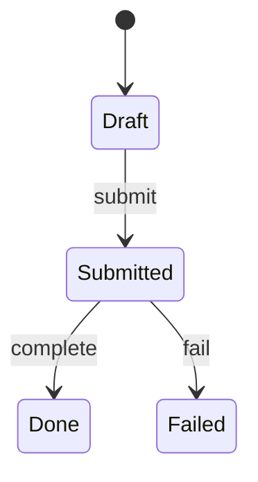

# 各类型标准模板

生成或修复时**按类型套模板**。必填节不可删；无内容写 `待确认` 并在报告挂 P2，禁止臆造。

## 可消费深度（api / domain 硬闸门）

`docs/api` 与 `docs/domain` **不是**「有个表格就算齐」。写完后须通过下列闸门，否则模板合规 = **不合格（P1）**：

| 文档 | 读者仅凭文档（+ 所链契约源）必须能 | 不合格典型 |
|------|-------------------------------------|------------|
| **api** | ① 在 **Postman** 建齐本模块请求（或一键 Import OpenAPI/Collection 并补齐环境变量）；② 在 **APISix / 网关** 配路由（uri、methods、upstream、鉴权插件、必要 header）；③ 对每个对外端点跑通至少 1 次成功 + 主要失败样例 | 只有端点名表、无字段/无完整 JSON、无 Base URL/鉴权、无网关节、示例只有「见代码」 |
| **domain** | ① 写出主流程与异常流程的**可执行测试步骤**；② 每步知道调哪些 API / 期望哪些状态与数据；③ 业务规则可写成 Given/When/Then 断言 | 只有散文叙事、无状态机、无用例表、无 API 触点、无法据此做流程回归 |

有完整 OpenAPI/proto 时：`docs/api` 仍须含 **环境·鉴权·网关·错误码·端点索引·每端点至少一组可复制示例**；schema 细节可链契约源，但**禁止**整篇只有链接而无示例。无契约源时：字段表 + 完整请求/响应 JSON **必须写在本文**。

可选产物（有则更佳，非替代 Markdown 必填节）：

- `docs/api/<模块>.openapi.yaml` 或链到仓内契约源（Postman / APISix 可 Import）
- `docs/api/<模块>.postman_collection.json`（与 Markdown 同步；改接口须同批更新）

细节闸门见 [consumable-depth.md](consumable-depth.md)。

文首统一元信息（Markdown 表或 YAML frontmatter，仓内择一，prd-sync 锁定）：

```markdown
# <标题>

| 项 | 内容 |
|----|------|
| type | api \| adr \| domain \| service \| mock \| ui \| data |
| module / service | <稳定标识> |
| status | current \| draft \| deprecated |
| last_verified | YYYY-MM-DD |
| related | [链接](相对路径) … |
| consumers |（api 建议）postman \| apisix \| e2e；（domain 建议）process-test \| qa |
```

---

## 1. `docs/api/<模块>.md`

面向：**联调、Postman Collection、APISix/网关路由、契约回归**。禁止「端点目录式」薄摘要。

```markdown
# API · <模块>

（元信息表；consumers 含 postman / apisix）

## 概述
一句话职责；调用方（BFF / 内部服务 / 第三方 / 控制台）；同步或异步。

## 契约源与可导入产物
- OpenAPI / Swagger / proto / 路由入口：**绝对仓内路径**
- 生成/校验命令（若有）：…
- Postman：Import 上述 OpenAPI，或配套 `docs/api/<模块>.postman_collection.json`
- 若无 OpenAPI：本文「端点详述」即为真源级说明书，禁止再写「详见代码」

## 环境与 Base URL

| 环境 | Base URL | 说明 |
|------|----------|------|
| local | `http://…` | … |
| staging | `https://…` | … |
| prod | `https://…` | … |

Postman 环境变量至少：`baseUrl`、`token`（或等价）、`tenantId`（若有多租户）。

## 鉴权与租户（Postman / 网关共用）

| 项 | 值 |
|----|-----|
| 认证方式 | Bearer JWT / API Key / mTLS / Cookie session / … |
| 获取 token | 登录接口或步骤（链到 auth 模块文档） |
| 必要 Header | 如 `Authorization`、`X-Tenant-Id`、`X-Request-Id` |
| Scope / 角色 | 本模块端点所需权限码（可表列） |
| 匿名可访问 | 列出路径；其余默认需鉴权 |

## 网关 / APISix 要点

供网关同学或自动化配路由，**不得省略**（无网关则写「直连服务，无独立网关」）：

| 项 | 内容 |
|----|------|
| 路由前缀 / uri | 如 `/api/v1/orders*` |
| methods | GET, POST, … |
| upstream | 服务名、端口、发现方式 |
| 插件建议 | 如 `key-auth` / `jwt-auth` / `limit-req` / `cors` / `proxy-rewrite` |
| 超时 / 重试 | 网关侧建议值 |
| 剥离/改写路径 | 若有 `proxy-rewrite` 规则写清 |

路由清单（可与端点索引合并）：

| 网关 uri | methods | upstream | 鉴权插件 | 备注 |
|----------|---------|----------|----------|------|
| … | … | … | … | … |

## 约定
- 内容类型：`application/json`（例外列出）
- 幂等键 Header（若有）：…
- 分页：`page`/`pageSize` 或 cursor；默认与上限
- 时间格式：ISO-8601 / Unix；时区
- 幂等与安全方法约定

## 端点索引

| ID | 方法 | 路径 | 摘要 | 鉴权 | 幂等 | 成功码 | 主要错误码 |
|----|------|------|------|------|------|--------|------------|
| ORD-01 | POST | `/orders` | 创建订单 | 是 | 否 | 201 | 400,409,422 |

**每个索引行必须在下文有同 ID 的「端点详述」小节**（禁止只留索引表）。

## 端点详述

对**每一个**对外端点复制下列块（内部调试-only 可标 `internal` 并缩短，但字段与示例仍须有）：

### ORD-01 · POST `/orders`

| 项 | 内容 |
|----|------|
| 摘要 | … |
| 鉴权 / 权限 | 需要；权限码… |
| 幂等 | 否 / 是（键=…） |
| 相关领域 | 链 `docs/domain/…` 步骤或规则 ID |

**Path 参数**

| 名 | 类型 | 必填 | 说明 | 示例 |
|----|------|------|------|------|
| — | — | — | — | — |

**Query 参数**

| 名 | 类型 | 必填 | 说明 | 示例 |
|----|------|------|------|------|
| … | … | … | … | … |

**请求 Header**（除全局约定外的）

| 名 | 必填 | 说明 | 示例 |
|----|------|------|------|
| … | … | … | … |

**请求 Body**

| 字段 | 类型 | 必填 | 约束 | 说明 | 示例 |
|------|------|------|------|------|------|
| … | … | … | … | … | … |

```json
{
  "example": "完整可复制请求体"
}
```

**响应**

| HTTP | 业务码（若有） | 说明 | 何时出现 |
|------|----------------|------|----------|
| 201 | 0 | 创建成功 | 校验通过 |
| 400 | … | 参数错误 | … |
| 401 | … | 未登录 | … |
| 409 | … | 冲突 | … |

成功响应示例：

```json
{
  "example": "完整可复制成功响应"
}
```

主要失败响应示例（至少 1 个业务失败）：

```json
{
  "example": "完整可复制错误 envelope"
}
```

**可复制调用**

```bash
curl -sS -X POST "$BASE_URL/orders" \
  -H "Authorization: Bearer $TOKEN" \
  -H "Content-Type: application/json" \
  -d '{ … }'
```

**Postman**：Method/URL/Body 与上表一致；Tests 建议断言 status + 业务码 + 关键字段存在。
**APISix**：对应路由行（uri/methods）见上节。

（下一个端点…）

## 核心对象

| 对象 | 字段 | 类型 | 约束 | 说明 |
|------|------|------|------|------|
| Order | id | string | … | … |

完整 JSON Schema 可链契约源；**本表 + 上文示例不得缺**。

## 错误模型

统一 envelope 形状（字段说明）+ **本模块业务码表**：

| 业务码 | HTTP | 含义 | 客户端建议 | 出现端点 |
|--------|------|------|------------|----------|
| … | … | … | 重试/改参/联系… | ORD-01 |

## 联调检查清单（可当冒烟）

| # | 步骤 | 期望 |
|---|------|------|
| 1 | 获取 token | 200 + access_token |
| 2 | 调用主路径成功样例 | 文档中的成功 JSON 形状 |
| 3 | 缺 token 调需鉴权接口 | 401 |
| 4 | 故意违反 1 条校验 | 4xx + 业务码 |

## 非目标 / 不做
明确不在本模块的能力。

## 变更注意
破坏性变更策略、版本头、弃用窗口；同步更新 OpenAPI/Collection/`last_verified`。
```

---

## 2. `docs/adr/<主题>-<模块|流程>.md`

```markdown
# ADR · <主题>

（元信息表；可加 `adr_id`: ADR-NNN）

## 状态
proposed | accepted | superseded（链到新 ADR）| deprecated

## 上下文
问题与约束（业务、规模、合规、已有系统）。

## 决策驱动因素
必须满足的点（可测、可排序）。

## 选项

| 选项 | 优点 | 缺点 |
|------|------|------|
| A … | … | … |
| B … | … | … |

## 决策
选了什么；一句话为什么。

## 后果
正向 / 负向；对部署、运维、API 兼容的影响。

## 后续
若需迁移，链到 `docs/service` 或任务列表；不写空话。
```

---

## 3. `docs/domain/<业务流程>.md`

面向：**业务流程测试、QA 用例、跨 API 编排验收**。禁止只有概念散文、无可执行步骤。

```markdown
# 领域 · <业务流程>

（元信息表；consumers 含 process-test / qa）

## 目标与范围
业务要达成什么；**边界外**明确列出（避免测错域）。

## 角色与权限

| 角色 | 类型（人/系统） | 可执行动作 | 权限码/说明 |
|------|-----------------|------------|-------------|
| … | … | … | … |

## 术语

| 术语 | 含义 | 对应对象/表（若有） |
|------|------|---------------------|
| … | … | … |

## 前置条件与夹具（测试用）

| ID | 前置 | 如何准备 | 关联 data/API |
|----|------|----------|---------------|
| FIX-01 | 存在可用租户与管理员 | … | … |
| FIX-02 | … | … | … |

## 主流程（Happy Path）

须达到「别人能照做」的粒度；每步写清 **触发方、动作、API/UI、期望状态**：

| 步 | 角色 | 动作 | API / UI 触点 | 期望结果（状态/数据） |
|----|------|------|---------------|------------------------|
| 1 | … | … | `POST /…`（ORD-01）或页面… | 状态=…；字段… |
| 2 | … | … | … | … |

可用 mermaid `sequenceDiagram` 或 `flowchart` 补充，**不能替代上表**。

## 分支与异常流程

| 分支 ID | 相对主流程何处分叉 | 触发条件 | 步骤摘要 | 期望 | 补偿/人工 |
|---------|-------------------|----------|----------|------|-----------|
| ALT-01 | 步 2 后 | 支付失败 | … | 状态=… | 重试/关单… |
| ALT-02 | … | … | … | … | … |

## 状态机

| 状态 | 含义 | 可迁往 | 触发（谁/什么事件/哪个 API） | 守卫条件 |
|------|------|--------|------------------------------|----------|
| … | … | … | … | … |



非法迁移须写明（客户端/服务端如何拒绝）。

## 业务规则（可测）

每条规则用 **Given / When / Then**，便于直接变测试：

| 规则 ID | Given | When | Then | 优先级 |
|---------|-------|------|------|--------|
| BR-01 | 订单为 Draft 且金额>0 | 调用提交 | 状态变 Submitted；写审计 | P0 |
| BR-02 | … | … | … | … |

## 流程测试场景包（Process Test Pack）

**本章是 domain 可毕业的核心**。每条场景须能手工或自动化执行：

| 场景 ID | 标题 | 覆盖（主/分支/规则） | 步骤（引用步号或写序列） | 期望断言 | 相关 API ID |
|---------|------|----------------------|--------------------------|----------|-------------|
| PT-01 | 主路径下单成功 | Happy + BR-01 | FIX-01 → 主流程 1..n | 终态 Done；… | ORD-01, ORD-02 |
| PT-02 | 支付失败可补偿 | ALT-01 | … | 状态 Failed；可重试 | … |
| PT-03 | 非法状态迁移被拒 | 状态机守卫 | … | 4xx + 业务码… | … |

场景数量：至少覆盖 **1 条主路径 + 主要失败/补偿 + 1 条权限或非法迁移**（域极简单可注明缩减理由）。

## 数据归属与一致性
关键实体归属哪一 `docs/data`；跨聚合一致性（同步/出箱/最终一致）一句话 + ADR 链接。

## SLA / 超时 / 重试
关键等待、超时后状态、重试次数与幂等要求（供测试设 wait/assert）。

## 相关 API / UI / 服务
| 类型 | 链接 | 用途 |
|------|------|------|
| api | `docs/api/…` | 端点详述 |
| ui | `docs/ui/…` | 界面触点 |
| service | `docs/service/…` | 运行依赖 |
```

---

## 4. `docs/service/<服务>.md`

```markdown
# 服务 · <服务名>

（元信息表）

## 职责
进程做什么；不做什么。

## 运行方式
- 入口命令 / 二进制 / 镜像
- 端口与协议
- 依赖服务（DB、MQ、下游）

## 配置

| 变量/键 | 必填 | 含义 | 示例（非密钥） |
|---------|------|------|----------------|
| … | … | … | … |

密钥只写「从何处注入」，禁止写真实密钥。

## 部署
环境差异（dev/staging/prod）；清单路径（compose/Helm/systemd）。

## 健康与观测
health/ready 路径；关键日志字段；指标名（若有）。

## 运维手册（轻量 runbook）
启动 / 停止 / 扩缩 / 常见故障「症状→检查→动作」。

## 相关文档
api / data / mock / adr 链接。
```

---

## 5. `docs/mock/<服务|模块>.md`

**硬性**：只描述假能力；禁止写成正式交付。

```markdown
# Mock 清单 · <服务|模块>

（元信息表；status 常用 draft/current，假能力清零后改为 deprecated 或删文件）

## 总览
为何存在 mock（本地联调 / 下游未就绪 / 演示）；默认是否启用。

## 清单

| ID | 位置（路径或符号） | 行为 | 如何启用/关闭 | 正式替代计划 | 风险 |
|----|-------------------|------|---------------|--------------|------|
| M1 | `path` — `Symbol` | 固定成功 / 假数据… | env/flag/… | issue 或「删除入口」 | 误上生产… |

## 禁止事项
- 不得在 README/api 文档宣称上述能力已交付（除非写明 mock）
- 生产配置默认值不得打开本清单项（若打开 → 升级 code-reviewer P0）

## 清零条件
列出可删除本文件的验收条件。
```

---

## 6. `docs/ui/<表面|流程>.md`

```markdown
# UI · <表面或流程>

（元信息表）

## 产品表面
Console / Admin / 用户端；桌面 only 或含移动。

## 信息架构
主导航、关键区；与路由表对应关系。

## 关键流（若本文写流程）
步骤、成功/失败/空态要点。

## 页菜谱对照
| 路由 | 菜谱（列表/详情/设置…） | 标杆页 | 备注 |
|------|-------------------------|--------|------|
| … | … | … | … |

## 设计约定
Token / 共享壳位置；链到设计系统或 ui-ux-reviewer 标杆。

## 权限表面
无权限时的表现（隐藏 / 禁用 / 诚实空态）。

## 非目标
不做的页面或动效。

## 相关
domain / api 链接；深扫用 ui-ux-reviewer。
```

---

## 7. `docs/data/<域|存储>.md`

```markdown
# 数据 · <域或存储>

（元信息表）

## 范围
管哪些实体；存储引擎（PG/MySQL/Redis/S3…）。

## 模型概览
| 实体 | 含义 | 关键约束 | 迁移位置 |
|------|------|----------|----------|
| … | … | … | `migrations/…` |

## 关系
简图或条列；聚合根与引用。

## 一致性与事务
跨表/跨库策略；出箱/双写（若有则链 ADR）。

## 保留与脱敏
TTL、软删、PII 注意。

## 迁移策略
expand/contract、回滚原则、谁执行。

## 相关
domain / service / api。
```

---

## 8. `docs/README.md`（索引）

```markdown
# 文档索引

## 体系说明
本仓采用 api / adr / domain / service / mock / ui / data 分类；约定见 `.cursor/rules/prd-sync.mdc`。

## 目录

| 类型 | 路径 | 说明 |
|------|------|------|
| API | [api/…](api/…) | … |
| … | … | … |

## 维护
- 代码变更触及契约/服务/领域时同步文档，并更新 `last_verified`
- Mock 清零后删除或标记 deprecated
- 新文档必须套对应模板必填节
```
