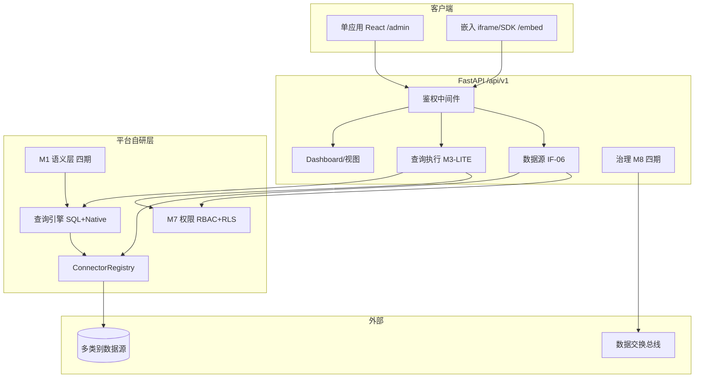

# VitalSpan — 技术架构

> **定位**：技术决策、目录约定、配置与环境变量；行为需求见 [SRS](srs/全生命周期系统需求规格说明书.md)，功能验收见 [PRD hub](automate/prd.md)。
> **维护**：架构或路由分层变更时同步本文件（见 `.cursor/rules/prd-sync.mdc` 文档同步总表）。

```yaml
version: 1.0.0
last_updated: 2026-07-17
status: bootstrap
srs_ref: docs/srs/全生命周期系统需求规格说明书.md
prd_ref: docs/automate/prd.md
```

---

## 1. 架构总览



**建设原则**（摘自 goal / SRS）：

- BI 层全部自研；**零** Superset / DataEase 运行时依赖（NFR-08）
- 一至三期：**主路径**为图表直连 `dataSourceId` + SQL/表/native；**Dataset 路径已提前可用**（META-004 + QUERY-009，见 §6.2）
- 四期：补齐 M1 Dataset 全量语义层、M2 设计器、M8 治理全自动

---

## 2. 技术决策（ADR 摘要）

| ID | 决策 | 理由 | 状态 |
|----|------|------|------|
| ADR-01 | 后端 **FastAPI** + OpenAPI 自动生成 | 与 FR-1.1 总线 OpenAPI 对齐；Python 生态适合 SQL/连接器 | 已定 |
| ADR-02 | 前端 **React + shadcn/ui + Radix + Tailwind v4** | SRS 已定目标栈；单应用主壳层 + Embed | 已定 |
| ADR-11 | 前端 **单应用 + RBAC 菜单**（非 `/portal` 双 URL） | 对标 DE/SS 权限模型；M1 兼容 `/admin/*`；见 `layout.md` ADR | 已定 |
| ADR-03 | 图表 **ChartEngine 抽象**；生产 **AntV**（G2Plot/G6/G2）；GIS 见 **ADR-12** | 业务层与具体库解耦；`buildEchartsOption` 仅测试/兼容 | 已定 |
| ADR-12 | **地图仅离线中国 GeoJSON**（GEO-IRON-01） | 政企内网/合规；零瓦片 CDN、零地图 Key；禁止境外与在线底图 | 已定 |
| ADR-13 | 前端 **`fe/src/components/charts/engine/`** 引擎端口 + registry | `CanvasChartHost` → `ChartEngineView`；`@antv/*` 仅 `engine/antv/**`；地图经 `GeoEnginePort`/`OfflineGeoPort` | 已定 |
| ADR-04 | **ConnectorRegistry** 插件式数据源 | NFR-04：新增类型不改核心服务与查询执行器 | 已定 |
| ADR-05 | 查询双路径：**SqlCapable** + **NativeQuery** | 关系型/OLAP 走 SQL；时序/文档/搜索走原生 DSL | 已定 |
| ADR-06 | 凭证 **Fernet / SM4** 可插拔（`CredentialCryptoProvider`） | NFR-03；默认 SM4；Fernet 遗留双读；API 不返回明文密码 | 已定 |
| ADR-16 | 登录密码 **SM3** 哈希（bcrypt 遗留双读 + 登录升级） | 政企国密应用层；JWT 仍 HS256 | 已定 |
| ADR-07 | 平台元数据 **PostgreSQL / MySQL 8+ / SQLite** | 生产推荐 PG 或 MySQL（对标 DataEase）；SQLite 用于开发单文件；与业务分析库分离 | 已定 |
| ADR-08 | M8 工作流 **Flowable / Camunda** 二选一 | 四期治理 BPM；具体选型待 M13 前锁定 | 待定 |
| ADR-09 | M6 报表 **JasperReports** 或等价 | 模板 Word/Excel/PDF；二期末前选型 | 待定 |
| ADR-10 | 演化指导库 **`.automate` submodule** | SOP/skills/agents 与产品代码分离；`install.sh` 同步至 `.cursor/` | 已部署 |
| ADR-14 | **组织组件库 `componentRef` 引用模式** | 单 widget 级复用；layout 仅存引用，payload 在 `viz_components`；保存时剥离内联配置 | 已定 |
| ADR-15 | **designer / gov query-design 双 API 收敛策略** | 短期保持双路由；中期抽取 `designer/translator` 公共模块；gov 委托 validate/preview | 已定 |

### ADR-15 · 查询设计器内核收敛（DESIGN-001 F-D）

**背景**：`/api/v1/designer/*`（四期查询设计器 + 快照/工单提交）与 `/api/v1/gov/query-design`（治理域可视化查询配置）在 validate / translate / preview 语义上重叠（DUP-01）。

| 维度 | `/api/v1/designer/*` | `/gov/query-design` |
|------|----------------------|---------------------|
| 用途 | Admin 设计器三面板 + 提交工单 | 治理 catalog 内可视化查询配置 |
| 存储 | designer snapshots / conditions / compute-rules | gov ref + `visual_query_design` |
| FE 入口 | `/admin/designer` | 治理工单链深链 |

**决策**：

- **短期（当前）**：保持双 API 与双 FE 页；不合并路由、不删 gov 端点。
- **中期（Phase 4）**：抽取 `backend/app/designer/translator/`；gov `query_design/service.py` 委托 designer validate + preview。
- **不做**：本里程碑不改动运行时行为；仅登记 ADR 供后续里程碑引用。

**代码锚点**：`backend/app/designer/` · `backend/app/governance/query_design/` · `fe/src/pages/admin/designer/DesignerPage.tsx` · `docs/automate/prd/F12-DESIGN.md` · `F10-GOV.md`

### ADR-14 · 组织组件库（DASH-010）

- **引用**：`LayoutWidget.componentRef = { componentId, pinnedRevision?, detached? }`；运行时经 `resolveLayoutWidget` 合并 `payloadJson`
- **持久化**：已链接 widget 保存时剥离 `chartConfig` / `filterConfig` / `textConfig` / `mediaConfig`（`stripLinkedWidgetForPersist`）
- **编辑**：Inspector 修改链接组件写回 `PUT /api/v1/viz-components/{id}`；断链后本地化副本（`detached: true`）
- **与模板区分**：`viz-templates` 为整页 layout 信封；`viz-components` 为单 widget 级组织库
- **代码锚点**：`backend/app/viz/components/` · `fe/src/lib/resolveVizComponent.ts` · `fe/src/components/dashboard/VizReuseDialog.tsx`

### ADR-12 · GEO-IRON-01（地图铁律）

- **仅中国**：中华人民共和国省级行政区（可扩展省→市下钻，资产仍为离线 GeoJSON）
- **仅离线**：`GeoEnginePort` / `OfflineGeoPort` + 仓库内或平台分发的 `.json`；**禁止**运行时拉取瓦片 CDN
- **3D 地形纹理**（仅 `map-3d`）：离线 hillshade WebP 贴 Extrude 顶面；`pnpm run build:geo-terrain` → `fe/src/assets/geo/terrain/`；详见 [ui/map-texture.md](ui/map-texture.md)
- **禁止**：高德/天地图/腾讯/Mapbox/MapLibre/OSM、AntV L7 在线 Scene、世界地图/境外行政区、地图 Key 配置项
- **执行规则**：`.cursor/rules/geo-map-offline-china.mdc`（`alwaysApply: true`）

---

## 3. 技术栈

| 层次 | 技术 | 说明 |
|------|------|------|
| 前端 UI | React · shadcn/ui · Radix · Tailwind CSS v4 | 单应用主壳层（`/admin/*`） |
| 前端图表 | ChartEngine（生产 AntV） | `fe/src/components/charts/engine/`；registry 全 canvas→antv；地图见 ADR-12 |
| 后端 API | FastAPI · Pydantic v2 · Uvicorn | REST `/api/v1/*` |
| 平台库 | SQLAlchemy 2 · Alembic | 元数据 ORM + 迁移；`DATABASE_URL` 支持 PostgreSQL / MySQL 8+ / SQLite |
| 连接层 | ConnectorRegistry · SQLAlchemy 连接池 | 按 `dataSourceId` 隔离 |
| SQL 方言 | 每连接器 dialect 模块 | RLS 注入、LIMIT、转义 |
| Native 驱动 | influxdb-client · pymongo · elasticsearch | `mode=native` |
| 鉴权 | 自建 RBAC + RLS（M7） | 不照搬 Superset FAB |
| 调度 | Quartz / XXL-JOB（待定） | M6 三期 |
| 参考产品 | DataEase · Superset | **仅设计走查**，不部署 |

---

## 4. 仓库目录

### 4.1 顶层（现状 · 2026-07-03）

```
VitalSpan/
├── backend/                 # FastAPI 应用（骨架）
│   └── app/
│       ├── core/            # 配置、鉴权、日志；nfr/ 横切（插件扩展/推送/信创）
│       ├── datasources/     # 连接层 + ConnectorRegistry
│       │   └── dialects/  # 按 type 分目录（CONN-*）
│       └── query/           # M3-LITE 查询执行
├── fe/                      # React 单应用前端（M1 Admin 壳层已实现）
├── docs/
│   ├── arch.md              # 本文件
│   ├── api/                 # OpenAPI 端点索引
│   ├── services/            # 域服务附录（随实现补充）
│   ├── srs/                 # 需求权威（SRS + 附录）
│   ├── automate/            # 演化文档 goal/prd/plan
├── tests/                   # 单元 / smoke（M1：health + me）
├── .automate/               # submodule：演化 SOP/skills/agents
├── .cursor/                 # 运行时：automate 同步 + 项目 rules
│   └── rules/               # vitalspan-project · fe-ui · backend-fastapi …
└── .agents/skills/          # 项目级 agent skills
```

### 4.2 后端目标布局（对齐 PRD 代码锚点）

```
backend/
├── app/
│   ├── main.py
│   ├── core/           # config, logging, TraceIdMiddleware；core/nfr/ 横切 NFR；鉴权委托 auth/
│   ├── api/v1/         # 路由聚合：datasources, query, dashboard, reports…
│   ├── auth/           # M7：roles, org, rls, audit
│   ├── datasources/    # registry, credentials, pool, metadata, dialects/*
│   ├── query/          # executor, binding, rls, dialects, dataset（四期）
│   ├── schemas/        # Pydantic：ChartViewConfig, QueryRequest…
│   ├── dashboard/      # M5 DashboardView
│   ├── views/          # FR-VIEW role/user templates
│   ├── reports/        # M6 engine, templates, scheduler
│   ├── metadata/       # M1 四期
│   ├── governance/     # M8 catalog, workflow, publish, bus
│   ├── ingestion/      # FR-DATA/FR-ETL：同步、清洗、调度（M1B）
│   └── designer/       # M2 四期
├── migrations/         # Alembic
└── pyproject.toml      # （待建）依赖与工具配置
```

### 4.3 前端目标布局

> 壳层与 IA 见 [ui/layout.md](../ui/layout.md)；源码目录 **`fe/`**（见 fe-ui.mdc）。

```
fe/
├── src/
│   ├── app/            # 路由、布局壳层
│   ├── pages/          # dashboard, explore, entity-overview, theme-analysis
│   ├── components/
│   │   ├── ui/         # shadcn 基元
│   │   ├── charts/     # M4 图表 + registry + adapters
│   │   └── dashboard/  # M5 组件库
│   ├── embed/          # iframe
│   ├── sdk/            # 门户 JS SDK
│   └── lib/            # api client, theme
├── package.json
└── vite.config.ts      # （建议）Vite + React
```

> **M1 过渡布局（2026-07-03）**：Admin 壳层已落地于 `fe/src/layouts/AdminLayout.tsx` +
> `fe/src/routes.tsx`（`/admin` 路由）。目标态目录 `src/app/` 在二期壳层统一时迁移；
> 详见 `prd/F01-BOOT.md` BOOT-002 与 `docs/ui/layout.md`。

### 4.4 演化与 Agent 资产

| 路径 | 角色 |
|------|------|
| `.automate/` | submodule **源**；改 skills/SOP/agents 后执行 `install.sh` |
| `.cursor/automate/` | 运行时 Read 路径（skills、sop、templates） |
| `.cursor/agents/` | evolution-* subagent 定义 |
| `docs/automate/` | goal · prd · plan · evolution-state |

---

## 5. API 约定

### 5.1 通用规则

- 前缀：`/api/v1/`
- 认证：Bearer Token / Session（一期 BOOT-003 落地后细化）
- 只读查询：禁止经查询 API 写入外部数据源
- 破坏性变更：升 `v2`，旧版保留过渡期

### 5.2 一期核心端点（IF-06 + 查询）

| 方法 | 路径 | 模块 | PRD |
|------|------|------|-----|
| GET | `/api/v1/datasources/types` | 连接层 | DS-007 |
| GET/POST/PUT/DELETE | `/api/v1/datasources` | 连接层 | DS-002 |
| POST | `/api/v1/datasources/test` | 连接层 | DS-003 |
| POST | `/api/v1/datasources/{id}/test` | 连接层 | DS-003 |
| GET | `/api/v1/datasources/{id}/schemas` | 元数据 | DS-004 |
| GET | `/api/v1/datasources/{id}/tables` | 元数据 | DS-004 |
| GET | `/api/v1/datasources/{id}/columns` | 元数据 | DS-004 |
| POST | `/api/v1/query/execute` | M3-LITE | QUERY-001 |
| GET | `/health` | 运维 | BOOT-001 |

> 完整路由索引维护于 [`docs/api/README.md`](../api/README.md)（按域分表；实现后更新状态列）。

### 5.3 查询请求体（一至三期）

```json
{
  "dataSourceId": "uuid",
  "mode": "sql | table | native",
  "querySql": "SELECT …",
  "tableName": "schema.table",
  "nativeQuery": { },
  "params": { },
  "limit": 1000
}
```

执行链：`鉴权 → M7 数据源授权 → RLS 谓词注入 → 方言/Native 执行 → QueryResult`。

---

## 6. 领域模型（摘要）

### 6.1 外部数据源

```
DataSourceCategory → DataSourceType → ConnectionConfig → dataSourceId
```

类别：`relational | olap | timeseries | document | search | lake | api`

类型全量枚举见 SRS §3.2 FR-2.0 与 PRD `F04-CONN`。

### 6.2 查询与展现

**路径 A — 直连（一至三期合同主路径 · QUERY-005）**

```
dataSourceId + ChartViewConfig(mode=sql|table|native)
  → POST /query/execute
  → 图表 / Dashboard 组件渲染
```

**路径 B — Dataset（四期能力 · 已提前落地 · META-004 + QUERY-009）**

```
Dataset CRUD（ORM `datasets` 表）
  → bind-query-config（dataset_query 配置）
  → POST /query/dataset/execute（真实 SQL 执行）
  → 图表 ChartViewConfig(mode=dataset, datasetId, configId)
```

两条路径**并存**：编辑页 `ChartEditRail` 可选 Dataset 或 SQL；快速创建向导默认走 Dataset。直连与 Dataset 可迁移（`POST /datasets/migrate-binding` 规划中）。

### 6.3 权限（M7）

```
权限维度 → 维度分组 → 角色 → 用户
资源：数据源 / Dashboard / 报表 / 工单节点
```

---

## 7. 配置与环境变量

### 7.1 配置文件约定

| 文件 | 用途 | 提交 Git |
|------|------|----------|
| `backend/.env.example` | 环境变量模板 | ✅ |
| `backend/.env` | 本地/部署秘密 | ❌ |
| `fe/.env.example` | 前端 `VITE_*` 模板 | ✅ |
| `docker-compose.yml` | 本地平台库 + 托管分析库 + 样例连接器库（见 §9） | ✅ |

### 7.2 后端环境变量（规划）

| 变量 | 必填 | 说明 | 默认 |
|------|:----:|------|------|
| `VITALSPAN_ENV` | | `development` / `staging` / `production` | `development` |
| `DATABASE_URL` | ✅ | 平台元数据库（PostgreSQL / MySQL 8+ / SQLite） | — |
| `SECRET_KEY` | ✅ | JWT / 会话签名 | — |
| `CREDENTIAL_FERNET_KEY` | ✅ | 遗留凭证 Fernet 解密 / fernet 写入模式 | — |
| `CREDENTIAL_SM4_KEY` | ✅* | 国密 SM4 凭证加密（`*` `CREDENTIAL_CRYPTO_PROVIDER=sm4` 时必填） | — |
| `CREDENTIAL_CRYPTO_PROVIDER` | | `sm4` / `fernet` | `sm4` |
| `PASSWORD_HASH_ALGORITHM` | | `sm3` / `bcrypt` | `sm3` |
| `CORS_ORIGINS` | | 前端源，逗号分隔 | `http://localhost:5173` |
| `LOG_LEVEL` | | 日志级别 | `INFO` |
| `QUERY_DEFAULT_LIMIT` | | 查询硬上限 | `1000` |
| `QUERY_TIMEOUT_SECONDS` | | 单次查询超时 | `30` |
| `ANALYTICS_DATABASE_URL` | | 平台托管分析库（M1B 同步/清洗目标库） | — |
| `DASHBOARD_AVAILABILITY_MODE` | | 核心看板可用性门禁：`strict`（不达标 503）/ `permissive` | `permissive` |
| `XINCHUANG_DEPLOY_MODE` | | 信创部署验收：`strict` / `permissive` / `conditional` | `permissive` |
| `RPT_DELIVERY_MODE` | | 报表调度投递：`mock` / `smtp`（MailHog 默认 1025） | `mock` |
| `RPT_SMTP_HOST` | | SMTP 主机（`RPT_DELIVERY_MODE=smtp`） | `localhost` |
| `RPT_SMTP_PORT` | | SMTP 端口 | `1025` |
| `RPT_SMTP_FROM` | | 发件人地址 | `reports@vitalspan.local` |

### 7.3 前端环境变量（规划）

| 变量 | 说明 |
|------|------|
| `VITE_API_BASE_URL` | 后端 API 根，如 `http://localhost:8000` |

---

## 8. 安全与合规

| 项 | 实现要点 | NFR |
|----|----------|-----|
| 传输 | 生产全站 HTTPS | NFR-03 |
| 凭证 | SM4 加密存储（默认）；Fernet 遗留双读；响应脱敏 | NFR-03 / ADR-06 |
| 登录密码 | SM3 哈希（bcrypt 遗留 + 登录升级） | ADR-16 |
| 查询 | 强制 LIMIT；参数化；RLS 注入 | M7 |
| 审计 | 权限变更、敏感操作写审计日志 | AUTH-008 |
| 依赖 | 禁止 GPL BI 运行时；信创连接器按需打包 | NFR-06/08 |

---

## 9. 本地开发

### 9.1 Compose 服务矩阵

| 服务 | 宿主机端口 | 库/用途 |
|------|-----------|---------|
| `postgres` | 5432 | 平台元库 `vitalspan`（`DATABASE_URL` 默认） |
| `meta-mysql` | 3309 | 平台元库 MySQL 8 备选（`DATABASE_URL=mysql://…@localhost:3309/vitalspan`） |
| `analytics-postgres` | 5433 | 托管分析库 `analytics`（`ANALYTICS_DATABASE_URL`；ingestion 同步目标） |
| `sample-mysql` | 3307 | 样例 OLTP `sample_db` |
| `sample-mariadb` | 3308 | MariaDB 连接器集成测 |
| `sample-clickhouse` | 8124 | ClickHouse 连接器集成测 |
| `sample-timescaledb` | **5434** | 运维时序样例 **`ops_tsdb`**（TimescaleDB；CONN-013 演示，**非** 5433） |

> **端口分工**：`5433` = 托管分析库；`5434` = TimescaleDB 专用样例源。详见 `docker/sample-timescaledb/README.md`。

### 9.3 数据库备份

```powershell
# Windows：备份 compose 全部数据服务 → data/backups/<timestamp>/
python scripts/backup-databases.py
# 或 .\scripts\backup-databases.ps1
```

恢复须同时保管 `keys-checklist.txt` 中列出的密钥（含 `CREDENTIAL_SM4_KEY` / `CREDENTIAL_FERNET_KEY`）。凭证国密迁移：`python scripts/migrate-credentials-to-sm4.py --dry-run`。

### 9.2 启动步骤
```bash
# 1. 平台依赖（按需启子集，如仅 mysql + analytics）
docker compose up -d

# 可选：运维时序样例库 + 灌数（约 7 天 ~160 万行）
docker compose up -d sample-timescaledb
python scripts/seed-ops-timescaledb.py   # 或 .\scripts\seed-ops-timescaledb.ps1

# 2. 后端
cd backend
cp .env.example .env
# 生成 SM4 密钥: python -c "import secrets; print(secrets.token_hex(16))"
alembic upgrade head
uvicorn app.main:app --reload --port 8000

# 3. 前端
cd fe
cp .env.example .env
pnpm dev            # 默认 :5173
```

一期冒烟（P1-SMOKE）：MySQL/PG 建源 → SQL → Dashboard 出数 + 越权失败。  
三期冒烟（P3-SMOKE）：TimescaleDB `sample-timescaledb:5434` 建源 → hypertable 元数据浏览 → 图表出数。

---

## 10. 文档索引

| 文档 | 内容 |
|------|------|
| [srs/README.md](srs/README.md) | 需求权威（SRS + 附录） |
| [全生命周期系统需求规格说明书.md](srs/全生命周期系统需求规格说明书.md) | SRS 主文档 |
| [automate/goal.md](automate/goal.md) | 产品方向与边界 |
| [automate/prd.md](automate/prd.md) | 功能真理源 hub（129 项） |
| [automate/plan.archive.md](automate/plan.archive.md) | 里程碑 M1–M13 |
| [automate/plan.md](automate/plan.md) | 活跃里程碑（当前 **P1–P3**；节 **M-FE-1**） |
| [api/README.md](api/README.md) | API 端点一行索引 |
| [services/README.md](services/README.md) | 域服务附录（随实现补充） |
| [ui/layout.md](ui/layout.md) | 壳层与信息架构（单应用 + Embed） |
| [ui/map-texture.md](ui/map-texture.md) | 3D 地图离线 hillshade 纹理管线（`map-3d`） |
| [superpowers/README.md](superpowers/README.md) | 演化轮次 design/plan 产出（G2–P3） |
| `.cursor/rules/` | Cursor 项目规则（见 `vitalspan-project.mdc`） |

---

## 修订记录

| 版本 | 日期 | 说明 |
|------|------|------|
| 1.0.2 | 2026-07-03 | FR-DATA/FR-ETL 纳入 M1B；增 ingestion 域与 ANALYTICS_DATABASE_URL |
| 1.0.3 | 2026-07-03 | ADR-11 单应用 + RBAC；架构图 WebApp + Embed；废止双 URL 双端 |
| 1.0.4 | 2026-07-17 | §9 compose 六服务；§6.2 双查询路径（直连 + Dataset）；Dataset 已落地说明 |
| 1.0.5 | 2026-07-30 | ADR-15 designer/gov query-design 收敛策略（DESIGN-001 F-D） |
