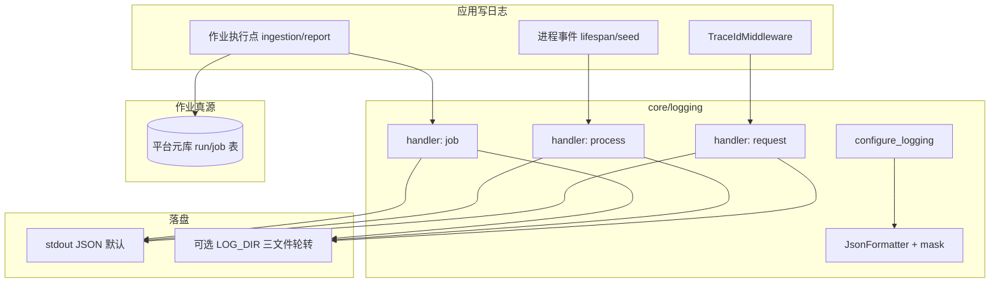
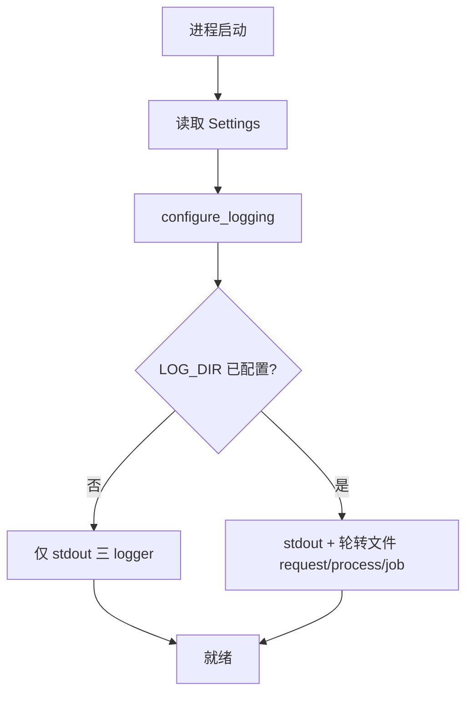
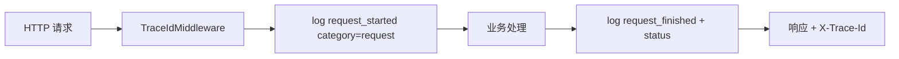
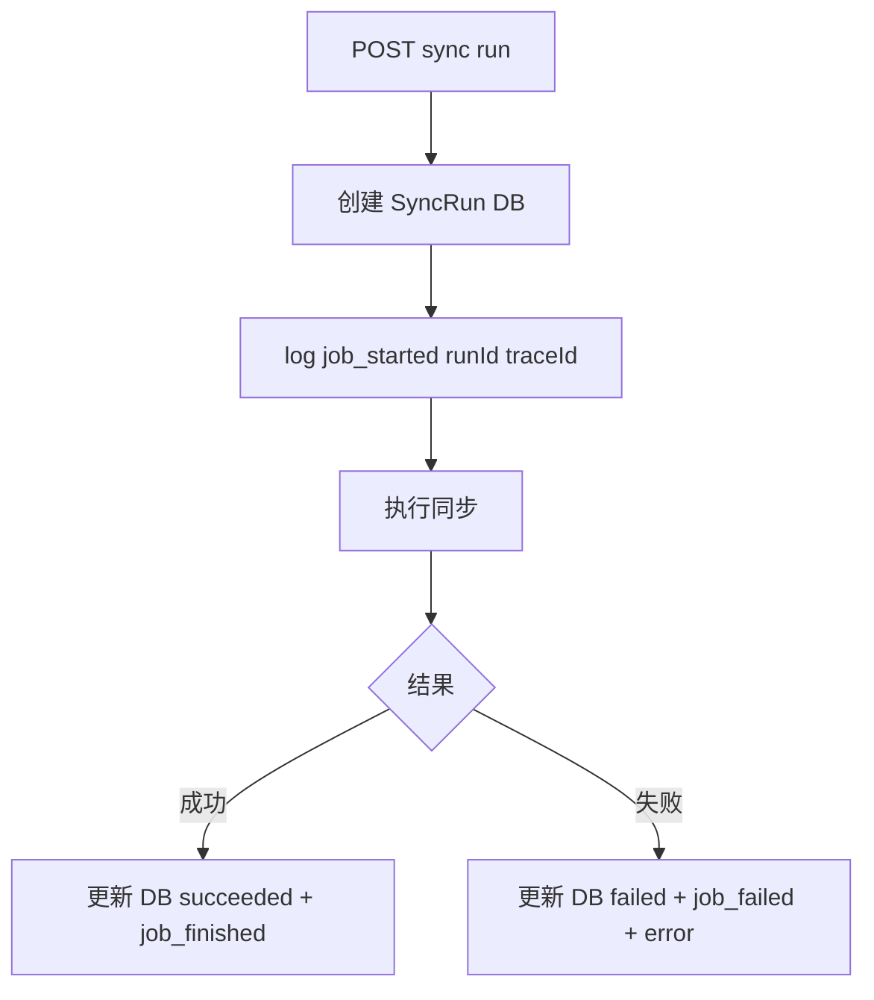

# 三类日志分轨 · 业务蓝图

## 元信息

| 项 | 值 |
|----|-----|
| mode | blueprint |
| scope | three-tier-logging（进程 / 请求 / 作业功能日志） |
| 日期 | 2026-08-09 |
| 证据袋 | [2026-08-09-three-tier-logging-evidence.md](./2026-08-09-three-tier-logging-evidence.md) |
| domain_strength | mixed |
| 假设状态 | **草稿待确认** |
| 关联 PRD | BOOT-004（基线已有）· F16-DATA（sync traceId）· 拟新增 NFR-R2-LOG |
| 关联 arch | `docs/arch.md` §7 · `docs/service/backend.md` |

### 智囊团

| 轮次 | 席别 | 结论 |
|------|------|------|
| 提纲 | architecture + product + plan（独立 Task） | revise → approve |
| 成稿 | 增量复评（同 Task 结论吸收） | approve with assumptions |

---

## 1. 问题与主任务

**JTBD**：运维与集成工程师在政企交付环境中，能按 **请求 / 进程 / 作业** 三类检索日志，用 `traceId` 串起 HTTP → 查询 → 同步/报表作业全链；日志可轮转保留，字段脱敏，且与 DB 作业历史不打架。

**成功**：staging 跑通 ingestion 手动 run + 报表调度投递后，能从日志与 DB 用同一 `traceId`/`runId` 定位失败点；compose/K8s 默认可 stdout 采集；裸机可开文件轮转。

**最贵失败**：显示「作业成功」但无作业轨事件 / trace 断链；或日志泄露凭证；或用日志文件替代 DB 导致状态不可查询。

---

## 2. 架构关系图

### 2.1 难回退选型约束

| ID | 选题 | 状态 | 证据 | 阻塞 F | 备注 |
|----|------|------|------|--------|------|
| S1 | 落盘：stdout 默认 + 可选 `LOG_DIR` 轮转 | **assumed** | production R2；E3 | F5 | 确认面请裁定生产默认 |
| S2 | DB=作业状态真源；日志=诊断事件 | anchored | ingestion_sync_runs 等 | F4 | 禁止日志替代 DB |
| S3 | JSON + traceId | anchored | BOOT-004 | F2 | 扩展 category 字段 |
| S4 | 统一脱敏层 | assumed | production R2 | F1–F4 | 扩字段前接入 mask |

---

## 3. 用户场景对照表

| 场景 | 角色 | 业内惯例 | VitalSpan 目标 | 偏离理由 |
|------|------|----------|----------------|----------|
| API 5xx 排障 | 运维 | request/access log 按 path/status | `category=request` + traceId | 现状混在 root stdout |
| 启动失败 | 运维 | process 日志见 seed/迁移错误 | `category=process` 结构化事件 | 现状有日志但无分类 |
| 同步失败 | 数据工程师 | job log + run 表 | `category=job` + runId；DB 仍可查历史 UI | F16 已要求 traceId |
| 报表投递失败 | 业务运维 | 投递通道错误可追 execution | job 轨 + `report_delivery_attempts` | 现状仅 warning 散落 |
| 权限变更追溯 | 安全 | **审计表**，非应用日志 | `auth_audit_events` + 管理端 | 不并入作业轨 |

---

## 3.1 术语表

| 术语 | 含义 | 勿混淆 |
|------|------|--------|
| 进程日志 | 应用生命周期、配置加载、seed、降级 | HTTP 请求 |
| 请求日志 | 每个 HTTP 请求 start/finish | 业务审计（AUTH-008） |
| 作业功能日志 | 同步/报表/导出等异步任务生命周期事件 | DB run 行本身；业务明细 dump |
| traceId | 请求级关联 ID | jobId/runId（作业级） |

---

## 4. 端到端业务流程

### 4.0 核心业务清单（≤5）

| ID | 业务名 | 成功结果 |
|----|--------|----------|
| F1 | 日志配置加载 | Settings 驱动 level、可选 LOG_DIR、三 handler 就绪 |
| F2 | 请求轨迹 | 每请求 start/finish JSON，含 traceId/category=request |
| F3 | 进程事件 | 启动/seed/关键 warn 带 category=process |
| F4 | 作业生命周期 | sync/report 调度点打 job 事件 + jobId/runId/traceId |
| F5 | 运维采集验收 | runbook：stdout 或三文件轮转 + 保留策略可验证 |

### F1 · 日志配置加载

### F2 · 请求轨迹

### F4 · 作业生命周期（示例：同步）

---

## 5. 与 PRD 偏航

| PRD | 现状勾选 | 偏航 | 建议 |
|-----|----------|------|------|
| BOOT-004 | 已实现（traceId+stdout） | production R2 未验收分轨/轮转 | **保持 BOOT-004 勾选**；新增 NFR-R2-LOG |
| F16-DATA sync | traceId 日志 | 无 job 轨统一 | NFR-R2-LOG 验收补全 |
| F15-NFR | 无日志专条 | R2 横切缺口 | 新增 NFR-R2-LOG 或扩 nfr.md |

---

## 6. 交付物（确认后 spec 映射）

| 交付物 | 路径/动作 |
|--------|-----------|
| 代码 | 扩展 `core/logging/`（拆分若超 200 行）；Settings：`LOG_DIR`、`LOG_ROTATION_*` |
| Logger 契约 | `vitalspan.http` · `vitalspan.app` · `vitalspan.job.ingestion` · `vitalspan.job.report` |
| JSON 字段 | `category`, `traceId`, `jobId`, `runId`, `event`（+ 现有 method/path/status_code） |
| 测试 | 扩展 `test_trace.py` + job category smoke |
| 文档 | `docs/service/backend.md` · `docs/services/core.md` 或 `nfr.md` · deploy runbook |
| PRD | 新增 `NFR-R2-LOG`（不自动改，点名后最小 diff） |

**明确不做（本期）**：日志检索 UI、ELK 搭建、RED 指标大盘、告警平台对接。

---

## 7. 假设清单（待确认）

| H# | 假设 | 类型 |
|----|------|------|
| H1 | 生产默认 **stdout 采集**；文件轮转为可配置可选项（S1） | 难回退选型 |
| H2 | 三文件命名约定：`request.log` · `process.log` · `job.log`（在 LOG_DIR 下） | 可逆 |
| H3 | JsonFormatter 扩展前接入与 API 同级的 mask 规则（S4） | 难回退 |
| H4 | 异步作业通过显式 `trace_id_var.set` 或参数传递保证 traceId 不断链 | 技术 |
| H5 | 管理端 `/admin/system/audit` 继续只展示 **业务审计**，不展示应用日志 | 产品边界 |

---

## 8. 修订记录

| 版本 | 日期 | 说明 |
|------|------|------|
| 0.1.0 | 2026-08-09 | 初稿：product-blueprint |
