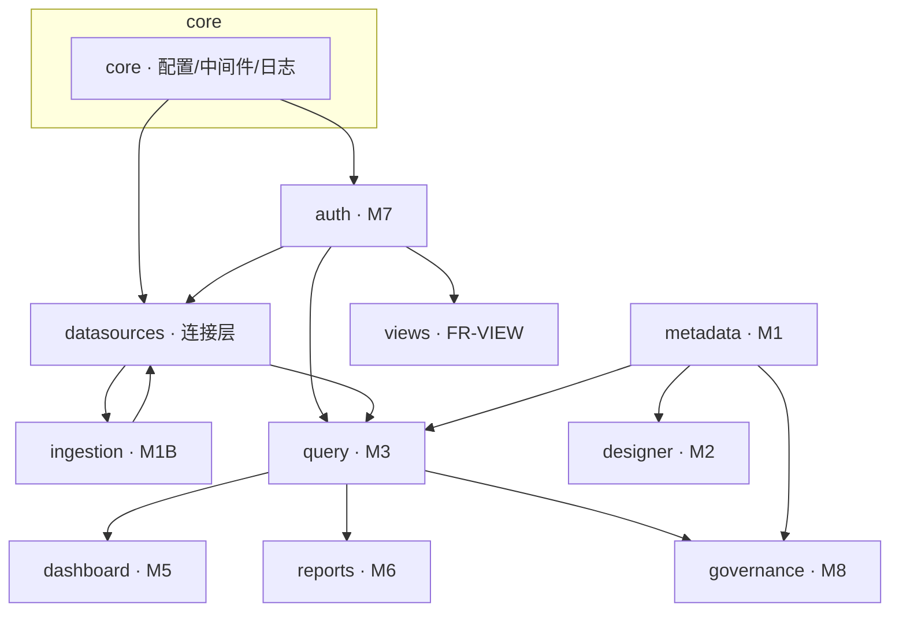

# 域服务附录

> **随实现补充**：描述后端各域服务的职责、边界、依赖与代码锚点。  
> 功能验收以 [prd.md](../automate/prd.md) 为准；HTTP 路由见 [api/README.md](../api/README.md)；目录与 ADR 见 [arch.md](../arch.md)。

## 维护约定

| 时机 | 动作 |
|------|------|
| 新建 `backend/app/<domain>/` 模块 | 创建或启用对应附录，填写「代码锚点」与「状态」 |
| 实现 PRD 功能项 | 在附录中登记主要类/函数，并回链 `XXX-NNN` |
| API 路由落地 | 同步 [api/README.md](../api/README.md) 状态列 |
| 跨域依赖变更 | 更新本文件「域依赖图」与各附录「依赖」节 |

**状态枚举**：`未实现` · `骨架` · `部分` · `已实现`

## 域索引

| 附录 | 后端模块 | PRD 分片 | 里程碑 | 状态 |
|------|----------|----------|--------|------|
| [core.md](./core.md) | `app/core/` | F01-BOOT | M1 | 已实现 |
| [nfr.md](./nfr.md) | `app/core/nfr/` | F15-NFR | 横切 | 部分（L1） |
| [metadata.md](./metadata.md) | `app/metadata/` | F11-META | M1（四期） | 部分（L1 · **META-004 ORM + 可视化编辑已实现**） |
| [datasources.md](./datasources.md) | `app/datasources/` | F03-DS · F04-CONN | 连接层 | 部分（L1 · r59 CONN-018 kingbase） |
| [query.md](./query.md) | `app/query/` | F05-QUERY | M3 | 部分（L1） |
| [designer.md](./designer.md) | `app/designer/` | F12-DESIGN | M2（四期） | 部分（L1 · r59 DESIGN-004 workflow-link） |
| [dashboard.md](./dashboard.md) | `app/dashboard/` | F07-DASH | M5 | **已实现**（v1 栅格 + v2 像素布局；Pointer QA 待执行） |
| [reports.md](./reports.md) | `app/reports/` | F08-RPT | M6/M10/M12 | **部分**（BE L1 + FE 中心/调度/重试已交付） |
| [views.md](./views.md) | `app/views/` | F09-VIEW | FR-VIEW | **部分**（VIEW-001~003 API + FE 偏好已接线） |
| [auth.md](./auth.md) | `app/auth/` | F02-AUTH | M7 | 已实现 |
| [ingestion.md](./ingestion.md) | `app/ingestion/` | F16-DATA | M1B | 已实现 |
| [governance.md](./governance.md) | `app/governance/` | F10-GOV · F14-CAT | M6 | **部分**（API L1；FE catalog 深链 + 诚实横幅） |
| [viz.md](./viz.md) | `app/viz/` | F06-VIZ | M9 | **部分**（BE 注册表 + FE **AntV** 渲染已实现） |
| [integration.md](./integration.md) | `app/integration/` | F13-API | M8/M12/M13 | companion 已实现（r45） |

**横切**：F13-API（对外集成）、F15-NFR（非功能）——F15-NFR 域附录见 [nfr.md](./nfr.md)；其余横切由各服务与 `core` 分担。F06-VIZ 图表类型注册与渲染/嵌入配置契约现由 [viz.md](./viz.md) 域承载。

## 域依赖图（目标态）

## 修订记录

| 版本 | 日期 | 说明 |
|------|------|------|
| 0.5.0 | 2026-07-04 | M8/M12/M13 r44：新增 integration 域（IF-01~04 集成 API L1 + OpenAPI 版本策略，API-003~007） |
| 0.5.2 | 2026-07-20 | reports/views/viz/governance 状态与 FE companion 对齐 |
| 0.5.1 | 2026-07-17 | datasources：CONN-013 专用 `sample-timescaledb:5434`；dashboard：surfaceKind 表面分化 |
| 0.4.0 | 2026-07-04 | M9 r42：新增 viz 域（ChartTypeRegistry + 9 类型、style/field 校验、render-spec、embed 契约，VIZ-003/004/005/006/008） |
| 0.3.0 | 2026-07-04 | M5 r29：VIZ 字段级 validate、图表 table 客户端分页；DASH layout 业务校验与 widget 编辑 |
| 0.2.0 | 2026-07-03 | 新增 ingestion 域（M1B / F16-DATA） |
