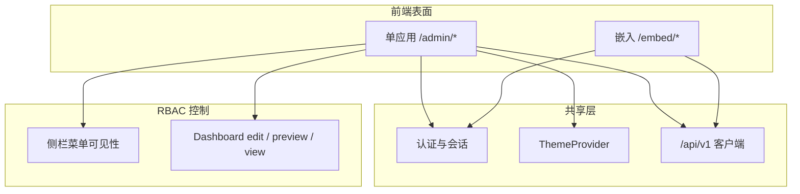

# VitalSpan — 壳层与信息架构（单应用）

> **定位**：单应用主壳层 + 独立 Embed 的**路由与导航 IA**；颜色、组件、Token、页面模式视觉见 **b-design-system-tailadmin-radix**（`.agents/skills/b-design-system-tailadmin-radix/SKILL.md`）及 `.cursor/rules/fe-ui.mdc`。
> **行为需求**：Dashboard/权限/嵌入能力见 [PRD](../automate/prd.md)；HTTP 路由见 [api/README.md](../api/README.md)。

```yaml
version: 1.1.0
last_updated: 2026-07-03
frontend_root: fe/
design_system: .agents/skills/b-design-system-tailadmin-radix
layout_pattern_ref: references/layout-patterns/app-shell.md
```

---

## 1. 单应用 + Embed 模型

VitalSpan 前端为 **单 Web 应用**（M1 路由前缀 `/admin/*`），共享认证、主题与 API 客户端；**嵌入（Embed）** 为 chromeless 独立表面。



| 表面 | 用户 | 目标 | 壳层参考 |
|------|------|------|----------|
| **单应用** | 租户管理员、数据工程师、业务分析员、决策者 | 配置与消费均在同一应用；菜单与页面模式由 **RBAC** 区分 | `app-shell` · Admin 列 |
| **嵌入 Embed** | 外部门户/Wiki/OA 访问者 | iframe/SDK 只读展现 | `bi-share-embed` · chromeless |

### ADR：现阶段不做双 URL 双端

| 决策 | 理由 |
|------|------|
| **采用单应用 + RBAC 菜单** | 对标 DataEase/Superset 为单应用权限模型；G4 可配置角色已覆盖建设/消费差异 |
| **不规划 `/portal/*`** | 避免两套路由树与 `PortalLayout` 维护成本；M1–M6 聚焦主壳层 |
| **保留 `/embed/*`** | NFR-07 / SRS 嵌入为独立交付形态，与主应用壳层无关 |
| **M1 保留 `/admin/*` 前缀** | 与已实现 `BOOT-002` 兼容；二期可评估迁为 `/*` |

> **未来可选 ADR**：若交付合同要求「管理端与分析端分入口 URL」，可再引入 `/portal/*`；届时须同步本文件与 `arch.md`。

**越权**：无权限访问路由或 API → `403` ContentState；不靠 URL 前缀做安全边界。

---

## 2. 壳层规格（与 fe-ui 一致）

> 数值与组件实现以 **b-design-system** `templates/layout/app-layout.tsx` 为准，禁止页面内自创比例。

| 元素 | 单应用主壳层 | 消费态（view 模式，同壳层） | 嵌入 Embed |
|------|-------------|---------------------------|------------|
| 侧栏宽度 | 290px（可折叠 90px）；RBAC 控制可见分组 | 同左；业务用户仅见授权分组（如 Dashboard、报表） | 无 |
| 顶栏 | 全功能 Header（搜索、通知、用户） | 同壳层；view 页可强化全局筛选器 | 无或仅标题条 |
| 内容区 | `max-w-(--breakpoint-2xl)` 居中（编辑/表格） | 可选全宽 `max-w-none`（图表优先） | 100% 宽高 |
| 侧栏持久化 key | `sidebar:app` | 同左 | — |
| 暗色 | 全局 `html.dark` | 同左 | 跟随父页或 `?theme=` |

**实现入口**（规划）：

```
fe/src/layouts/AdminLayout.tsx      # AppLayout + RBAC 导航（M1 已落地）
fe/src/layouts/EmbedLayout.tsx      # 最小 chrome（后续里程碑）
```

**默认落地**（登录后）：有 `dashboard:edit` 等建设权限 → 运营总览或 Dashboard 列表；仅消费权限 → 重定向至角色默认 Dashboard（FR-VIEW-3）`/admin/dashboards/:id`（view）。

**空态**：平台出厂无预装 Dashboard → ContentState「联系管理员配置数据源与仪表板」。

---

## 3. 单应用 IA（`/admin/*`）

面向 G3/G4/G5：**不预置业务菜单**；出厂导航仅含平台能力分组；消费与建设路由共存，由 RBAC 控制可见性与 edit/view 模式。

```
/admin
├── /login                          # 认证（壳层外）
├── /                                # 运营总览（可选）或按角色重定向至默认 Dashboard
│
├── 数据                            # 建设权限（RBAC）
│   ├── /datasources                 # 数据源列表 · crud-flow
│   ├── /datasources/new             # 新建 · form-flow
│   ├── /datasources/:id             # 详情/连通性/schema · detail-page
│   └── /connectors                  # 已注册类型只读（DS-007）
│
├── 分析                            # 建设 + 消费
│   ├── /dashboards                  # Dashboard 列表 · table-list（全员可见授权项）
│   ├── /dashboards/:id              # 查看 view · bi-dashboard-builder（只读）
│   ├── /dashboards/:id/edit         # 构建器 edit · bi-dashboard-builder
│   ├── /dashboards/:id/preview      # 构建器 preview
│   ├── /dashboards/:id/share        # 分享/嵌入 · bi-share-embed（有 edit 权）
│   ├── /charts/explore              # 即席图表（三期）· bi-chart-builder
│   └── /designer                    # 查询设计器（四期）· form-composition
│
├── 报表
│   ├── /reports                     # 授权报表列表（消费）
│   ├── /reports/:id                 # 报表查看
│   ├── /reports/templates           # 模板目录 · tree-table（建设）
│   ├── /reports/templates/:id       # 模板编辑
│   └── /reports/schedules           # 调度（三期）
│
├── 主题与实体
│   ├── /themes                      # 主题分析配置（二期）· hub-tabs
│   ├── /themes/:id                  # 主题阅读态（消费，二期）
│   └── /entities/overview           # 实体总览配置（二期）
│
├── 治理
│   ├── /governance/catalog          # 接口分类（一期 PoC）
│   ├── /governance/tickets          # 工单（四期）· master-detail-ops
│   └── /governance/publish          # 发布流水线（四期）
│
├── 语义层（四期）
│   ├── /metadata/glossary
│   ├── /metadata/themes
│   └── /datasets                    # bi-dataset-management
│
├── 我的
│   └── /me/views                    # 我的视图 / 覆盖（三期）· FR-VIEW-4
│
└── 系统                            # 管理员（RBAC）
    ├── /system/roles                # AUTH · crud-flow
    ├── /system/users                # AUTH
    ├── /system/orgs                 # AUTH
    ├── /system/rls                  # 行级权限 · form-composition
    └── /system/audit                # 审计日志 · table-list
```

### 侧栏导航分组（RBAC 可见）

| 分组 | 图标区 | 典型权限 | 一期可用 |
|------|--------|----------|----------|
| 数据 | 数据源、连接器 | `datasource:*` | ✅ 数据源 |
| 分析 | Dashboard、探索 | `dashboard:read` / `dashboard:edit` | ✅ Dashboard |
| 报表 | 列表、模板、调度 | `report:read` / `report:edit` | 二期起 |
| 主题与实体 | 主题、实体总览 | 二期权限点 | 二期起 |
| 治理 | 分类、工单、发布 | 治理权限 | PoC 起 / 四期完整 |
| 语义层 | 术语、Dataset | 四期 | 四期 |
| 我的 | 视图覆盖 | `view:override` | 三期 |
| 系统 | 角色、用户、权限、审计 | `system:*` | ✅ 角色/权限地基 |

---

## 4. 嵌入 IA（`/embed/*`）

| 路由 | 说明 | 布局模式 |
|------|------|----------|
| `/embed/:token` | 校验 embed token 后渲染单个 Dashboard/图表 | chromeless + `ChartPanel` |
| SDK | `fe/src/sdk/` 初始化，容器内挂载 | `bi-share-embed` |

域名白名单、token 过期、撤销 → 见 PRD API-006 / VIZ-007。

---

## 5. 路由 ↔ 布局模式 ↔ PRD

| 路由（代表） | 布局模式（b-design-system） | PRD |
|-------------|---------------------------|-----|
| `/admin/datasources` | `crud-flow` + `table-list` | DS-* |
| `/admin/dashboards/:id/edit` | `bi-dashboard-builder`（edit） | DASH-*, VIZ-* |
| `/admin/dashboards/:id` | `bi-dashboard-builder`（view） | DASH-*, VIEW-* |
| `/admin/dashboards/:id/share` | `bi-share-embed` | VIZ-006, API-006 |
| `/admin/system/rls` | `form-composition` | AUTH-* |
| `/admin/governance/tickets` | `master-detail-ops` | GOV-* |
| `/admin/datasets` | `bi-dataset-management` | META-* |
| 数据大屏（可选） | `bi-data-screen` | DASH-003 |

检索路径：`pattern-index.md` → `layout-patterns/*.md` → `templates/**`。

---

## 6. 分期与导航可见性

| 里程碑 | 单应用新增导航 / 能力 |
|--------|----------------------|
| M1–M6 一期 | 数据、Dashboard（edit + view）、系统/权限 |
| M7–M10 二期 | 报表、主题、实体；角色默认视图（FR-VIEW-3） |
| M11–M12 三期 | 图表探索、调度、我的视图（FR-VIEW-4）、Embed SDK |
| M13 四期 | 语义层、治理工单/发布、设计器、已发布查询服务入口（可选） |

未到期能力：**侧栏不展示**或标「即将推出」；禁止死链。

---

## 7. 前端目录约定（`fe/`）

与 [fe-ui.mdc](../../.cursor/rules/fe-ui.mdc) 对齐：

```
fe/src/
├── layouts/           # AdminLayout（主壳层）· EmbedLayout
├── pages/
│   └── admin/         # 单应用页面（*Page.tsx 路由入口）
├── components/
│   ├── ui/            # shadcn 基元
│   └── admin/         # 业务复用块
├── embed/             # iframe 挂载
├── sdk/               # 嵌入 SDK（三期）
├── lib/               # api · queryKeys · apiError
└── routes.tsx         # react-router v7 嵌套路由
```

写页面前必读 `fe/src/components/README.md`；视觉实现 **必须** 走 b-design-system Skill，提交前 `pnpm run check:design`。

---

## 8. 文档交叉引用

| 文档 | 内容 |
|------|------|
| [arch.md](../arch.md) | 技术栈、客户端在架构图中的位置 |
| [api/README.md](../api/README.md) | 页面调用的 HTTP 路由 |
| [automate/plan.md](../automate/plan.md) | 当前里程碑决定导航可见性 |
| b-design-system `app-shell.md` | 单应用壳层规格（通用） |
| b-design-system `bi-dashboard-builder.md` | Dashboard 三模式 edit/preview/view |

---

## 修订记录

| 版本 | 日期 | 说明 |
|------|------|------|
| 1.0.0 | 2026-07-03 | 初版：Admin/Portal/Embed 双端 IA（已废止） |
| 1.1.0 | 2026-07-03 | 单应用 + Embed；合并消费路由；ADR 不做 `/portal/*` |
