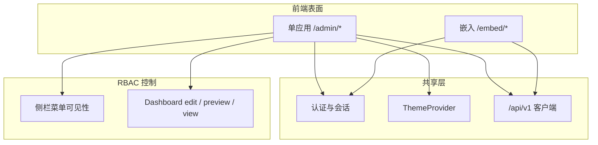

# VitalSpan — 壳层与信息架构（单应用）

> **定位**：单应用主壳层 + 独立 Embed 的**路由与导航 IA**；颜色、组件、Token、页面模式视觉见 **b-design-system-tailadmin-radix**（`.agents/skills/b-design-system-tailadmin-radix/SKILL.md`）及 `.cursor/rules/fe-ui.mdc`。
> **行为需求**：Dashboard/权限/嵌入能力见 [PRD](../automate/prd.md)；HTTP 路由见 [api/README.md](../api/README.md)。

```yaml
version: 1.3.3
last_updated: 2026-07-20
frontend_root: fe/
design_system: .agents/skills/b-design-system-tailadmin-radix
layout_pattern_ref: references/layout-patterns/app-shell.md
```

---

## 1. 单应用 + Embed 模型

VitalSpan 前端为 **单 Web 应用**（M1 路由前缀 `/admin/*`），共享认证、主题与 API 客户端；**嵌入（Embed）** 为 chromeless 独立表面。



| 表面 | 用户 | 目标 | 壳层参考 |
|------|------|------|----------|
| **单应用** | 租户管理员、数据工程师、业务分析员、决策者 | 配置与消费均在同一应用；菜单与页面模式由 **RBAC** 区分 | `app-shell` · Admin 列 |
| **嵌入 Embed** | 外部门户/Wiki/OA 访问者 | iframe/SDK 只读展现 | `bi-share-embed` · chromeless |

### ADR：现阶段不做双 URL 双端

| 决策 | 理由 |
|------|------|
| **采用单应用 + RBAC 菜单** | 对标 DataEase/Superset 为单应用权限模型；G4 可配置角色已覆盖建设/消费差异 |
| **不规划 `/portal/*`** | 避免两套路由树与 `PortalLayout` 维护成本；M1–M6 聚焦主壳层 |
| **保留 `/embed/*`** | NFR-07 / SRS 嵌入为独立交付形态，与主应用壳层无关 |
| **M1 保留 `/admin/*` 前缀** | 与已实现 `BOOT-002` 兼容；二期可评估迁为 `/*` |

> **未来可选 ADR**：若交付合同要求「管理端与分析端分入口 URL」，可再引入 `/portal/*`；届时须同步本文件与 `arch.md`。

**越权**：无权限访问路由或 API → `403` ContentState；不靠 URL 前缀做安全边界。

---

## 2. 壳层规格（与 fe-ui 一致）

> 数值与组件实现以 **b-design-system** `templates/layout/app-layout.tsx` 为准，禁止页面内自创比例。

| 元素 | 单应用主壳层 | 消费态（view 模式，同壳层） | 嵌入 Embed |
|------|-------------|---------------------------|------------|
| 侧栏宽度 | 290px（可折叠 90px）；RBAC 控制可见分组 | 同左；业务用户仅见授权分组（如 Dashboard、报表） | 无 |
| 顶栏 | 全功能 Header（搜索、通知、用户） | 同壳层；view 页可强化全局筛选器 | 无或仅标题条 |
| 内容区 | `max-w-(--breakpoint-2xl)` 居中（编辑/表格） | 可选全宽 `max-w-none`（图表优先） | 100% 宽高 |
| 侧栏持久化 key | `sidebar:app` | 同左 | — |
| 暗色 | 全局 `html.dark` | 同左 | 跟随父页或 `?theme=` |

**实现入口**（规划）：

```
fe/src/layouts/AdminLayout.tsx      # AppLayout + RBAC 导航（M1 已落地）
fe/src/layouts/EmbedLayout.tsx      # 最小 chrome（后续里程碑）
```

**默认落地**（登录后）：有 `dashboard:edit` 等建设权限 → 运营总览或 Dashboard 列表；仅消费权限 → 重定向至角色默认 Dashboard（FR-VIEW-3）`/admin/dashboards/:id`（view）。

**空态**：平台出厂无预装 Dashboard → ContentState「联系管理员配置数据源与仪表板」。

---

## 3. 单应用 IA（`/admin/*`）

面向 G3/G4/G5：**不预置业务菜单**；出厂导航仅含平台能力分组；消费与建设路由共存，由 RBAC 控制可见性与 edit/view 模式。

```
/admin
├── /login                          # 认证（壳层外）
├── /                                # 运营总览（可选）或按角色重定向至默认 Dashboard
│
├── 数据                            # 建设权限（RBAC）
│   ├── /datasources                 # 连接管理 · crud-flow
│   ├── /datasources/new             # 新建 · form-flow（含类型选型向导）
│   ├── /datasources/:id             # 详情/连通性/schema · detail-page
│   ├── /ingestion/sync-jobs         # 同步任务（侧栏挂在「数据连接」下，非一级项）
│   ├── /datasets                    # 数据集（对标 DataEase；侧栏一级，M13）
│   ├── /metadata                    # 语义层元数据（**已移出侧栏**；路由保留，深链可达）
│   │
│   > **实体与主题**（`/entities/overview`、`/themes/:id`）**已移出侧栏**；路由与能力保留，深链可达。
│
├── 分析                            # 建设 + 消费（默认展开）
│   ├── /dashboards                  # Dashboard 列表 · table-list（全员可见授权项）
│   ├── /data-screens                # 数据大屏列表 · bi-data-screen（`surfaceKind=data-screen`）
│   ├── /data-screens/:id            # 大屏查看 → 重定向 `/preview`（Wave 2.5 A1）
│   ├── /data-screens/:id/edit       # 大屏编辑（DataScreenEditViewport + PixelCanvas）
│   ├── /data-screens/:id/preview    # 大屏全屏预览投放（`DataScreenPreviewPage` + `DataScreenPresenter`）
│   ├── /data-screens/:id/share      # 大屏分享/整屏嵌入（`DataScreenSharePanel`）
│   ├── /viz-templates               # 可视化模板 Hub（看板+大屏；≠ 报表模板）
│   ├── /viz-components              # 组织组件库（componentRef 引用；看板/大屏复用）
│   ├── /dashboards/:id              # 查看 view · bi-dashboard-builder（只读）
│   ├── /dashboards/:id/edit         # 构建器 edit · bi-dashboard-builder
│   ├── /dashboards/:id/preview      # （规划）构建器 preview；当前以 `/dashboards/:id` view 模式替代
│   ├── /dashboards/:id/share        # 分享/嵌入 · bi-share-embed（含公开链接 + iframe 嵌入）
│   # 图表类型目录：Palette Drawer「查看全部类型」（无独立 `/charts/types` 路由；旧路径重定向 dashboards）
│
├── 报表
│   ├── /reports/center              # 报表中心 hub（授权模板 + 快捷入口）
│   ├── /reports                     # 预制分析报表
│   ├── /reports/view/:nodeId        # 报表查看与运行
│   ├── /reports/templates           # 模板目录（admin · `report:manage`）
│   ├── /reports/templates/:id       # 模板编辑
│   └── /reports/schedules           # 调度（admin · `report:manage`）
│
├── 我的                            # 用户菜单进入（脱离主侧栏 IA）
│   ├── /account/profile             # 用户资料
│   ├── /account/theme               # 界面主题
│   ├── /account/landing             # 登录入口（个人视图 / 角色默认看板）
│   └── /account/security            # 安全设置（修改密码）
│   # /account/preferences、/account/settings 重定向至 landing（兼容旧链接）
│
├── 后台管理                        # 用户菜单进入（admin · `system:*`）
│   ├── /system/roles                # AUTH · crud-flow（含维度分组绑定入口见 RLS）
│   ├── /system/users                # AUTH
│   ├── /system/orgs                 # AUTH
│   ├── /system/rls                  # 行级权限：维度/分组 CRUD + 角色绑定 · form-composition
│   ├── /system/audit                # 审计日志（含时间窗筛选）· table-list
│   └── /system/grants               # 资源授权 · table-list + dialog form
│
├── 治理                            # H1：固定隐藏（无 env 开关；测试可传 resolveNav govNavEnabled）
│   ├── /governance/catalog         # 深链可达；页顶诚实横幅（未对接真实总线）
│   ├── /governance/tickets
│   ├── /governance/publish
│   ├── /services                    # 已发布查询服务（IF-02）
│   └── /designer                    # 查询设计器（四期）· 治理专用 Badge
```

### 侧栏导航分组（RBAC 可见）

| 分组 | 图标区 | 典型权限 | 里程碑 | 角色 | 默认 IA |
|------|--------|----------|--------|------|---------|
| 分析 | 仪表板、数据大屏、可视化模板 | — | M1/M5 | admin/analyst/viewer | **展开**（主路径） |
| 报表 | 报表中心（含「全部报表」hub；analyst/viewer 见全部报表+预制；admin 另含模板/调度） | `report:read` / `report:manage` | M1/M7/M11 | 全员 | **展开** |
| 数据 | 数据连接（连接管理/同步任务）、**数据集** | `datasource:*` / `dataset:*` | M1/M13 | admin | **展开** |
| 治理 | 治理流程、查询服务、查询设计器 | `governance:*` | M1/M13 | admin | **H1 固定隐藏**（测试专用 `govNavEnabled`） |
| 我的 | 个人资料、偏好、安全 | — | — | 全员 | 头像菜单进入 |
| 后台管理 | 权限与安全 / 组织 / 审计 | `system:*` | M1 | admin | 头像菜单进入 |

> **H1（客户交付）**：`fe/src/lib/gov-nav.ts` + `nav-manifest.requiresGovNav`；默认不展示「治理」，避免 InMemory 总线冒充。深链仍可达，路由壳层展示「未对接真实总线 / 差异化能力」横幅。  
> **已移出侧栏（路由保留）**：图表类型目录、实体总览、主题分析、独立「数据接入」一级项、**语义层元数据**（`/admin/metadata`；术语/主题/维度字典能力保留，对标 DataEase 不在顶栏单独暴露）。  
> **生产不注册**：`/embed/sdk-demo` 仅 `import.meta.env.DEV`。  
> **nav 单一真理源**：主 IA `fe/src/config/nav-manifest.tsx`；个人中心 `account-nav.tsx`、后台管理 `system-admin-nav.tsx`；派生：`fe/src/lib/resolve-nav.ts`。
---

## 4. 嵌入 IA（`/embed/*`）

| 路由 | 说明 | 布局模式 |
|------|------|----------|
| `/embed/chart/:chartId` | 单图嵌入（须 `?token=`） | chromeless |
| `/embed/screen/:dashboardId` | 数据大屏整屏嵌入（须 `?token=`；`DataScreenPresenter`） | chromeless |
| `/embed/share` | 嵌入配置与 token 签发 | `bi-share-embed` |
| SDK | `fe/src/sdk/` 初始化，容器内挂载 | `bi-share-embed` |

域名白名单、token 过期、撤销 → 见 PRD API-006 / VIZ-007。

---

## 5. 路由 ↔ 布局模式 ↔ PRD

| 路由（代表） | 布局模式（b-design-system） | PRD |
|-------------|---------------------------|-----|
| `/admin/datasources` | `crud-flow` + `table-list` | DS-* |
| `/admin/dashboards/:id/edit` | `bi-dashboard-builder`（edit） | DASH-*, VIZ-* |
| `/admin/data-screens` | `bi-data-screen` 列表；`GET /dashboards?surfaceKind=data-screen` | DASH-002 companion |
| `/admin/data-screens/:id/edit` | `bi-data-screen` 编辑：`DataScreenEditViewport`（平移/缩放/标尺）+ `PixelCanvas`（`designViewportLocked`） | DASH-002 companion |
| `/admin/data-screens/:id` | `bi-data-screen` 查看 view（同壳层只读编辑页） | DASH-002 companion |
| `/admin/data-screens/:id/preview` | 全屏投放：`DataScreenPresenter` + `CanvasScaleViewport`（只读，无 pan） | DASH-002 companion |
| `/admin/data-screens/:id/share` | `bi-share-embed`（复用分享页） | VIZ-006, API-006 |
| `/admin/dashboards/:id` | `bi-dashboard-builder`（view） | DASH-*, VIEW-* |
| `/admin/dashboards/:id/share` | `bi-share-embed` | VIZ-006, API-006 |
| `/admin/viz-components` | 组织组件库 Hub；`componentRef` 引用管理 | DASH-010 |
| `/admin/viz-components/:id/edit` | 组件库内编辑（复用看板 Inspector + 实时预览） | DASH-010 |
| `/admin/viz-templates` | 可视化模板 Hub（整页 layout 信封） | DASH-009 companion |

**DashboardView 适配（VIEW-001 companion）**：Dashboard 存储形态为 `layoutJson`（widgets + globalFilters）；消费/校验时经 `dashboardLayoutToView()`（`fe/src/lib/dashboardLayoutToView.ts` · 后端 `views/adapter.py`）映射为 FR-VIEW-1 `DashboardView` 文档（含 `protocolVersion: 1` 与 `dashboardId`）。`PUT /api/v1/dashboards/{id}/layout` 在持久化前执行 DashboardView 校验，与 `POST /api/v1/views/validate` 同域错误码。

### 数据大屏：编辑视口 vs 投放视口

| 场景 | 组件 | 行为 |
|------|------|------|
| **编辑** `/data-screens/:id/edit` | `DataScreenEditViewport` | 独立「相机」：`useDataScreenViewportState` 管理 `viewPan` + `userZoom` × fit 缩放；**空格/中键**拖画布；**Ctrl+滚轮**指针锚点缩放；**标尺十字线**跟鼠标；右下角 `CanvasScaleArea`（比例下拉/±/重置）；`PixelCanvas` `designViewportLocked` |
| **投放/预览** `/preview`、`/embed/screen/:id` | `DataScreenPresenter` + `CanvasScaleViewport` | 只读 fit 缩放，无编辑平移；不混用编辑视口 |

代码锚点：`fe/src/components/dashboard/screen/DataScreenEditViewport.tsx` · `useDataScreenViewportState.ts` · `CanvasRulerCrosshair.tsx` · `fe/src/components/dashboard/dashboard-edit/DashboardEditCanvas.tsx`（`isDataScreenEdit` 分支）。

**素材组件（对标 DataEase）**：数据大屏编辑工具栏 **更多** 含时钟/边框/标题装饰；**素材** 为图标网格（日期时间、网页）。选中素材组件时右栏提供 **数据 + 样式** Tab（`ScreenVisualEditRail` / 网页走 `MediaEditRail`）。代码锚点：`fe/src/components/dashboard/CanvasEditToolbar.tsx` · `screen/ScreenMaterialPicker.tsx` · `lib/screenVisualAssets.ts` · `lib/screenVisualStyle.ts`。

| `/admin/reports/center` | hub 卡片 + 授权模板网格 | RPT-002/004 |
| `/admin/reports` | `table-list` + 运行结果区 | RPT-002 |
| `/admin/reports/view/:nodeId` | 运行 + 结果 + 导出 | RPT-001 |
| `/admin/reports/templates` | `master-detail` 树 + 扩展配置 Tabs | RPT-004/006 |
| `/admin/reports/templates/:nodeId` | 同上（深链选中节点） | RPT-004/006 |
| `/admin/themes/:dashboardId` | hub-tabs（配置 \| 分析） | DASH-006 |
| `/admin/system/rls` | `form-composition` | AUTH-* |
| `/admin/governance/tickets` | `master-detail-ops` | GOV-* |
| `/admin/datasets` | `bi-dataset-management` | META-* |
| 数据大屏（`surfaceKind=data-screen`） | `bi-data-screen` | DASH-002 companion |

检索路径：`pattern-index.md` → `layout-patterns/*.md` → `templates/**`。

---

## 6. 分期与导航可见性

| 里程碑 | 单应用新增导航 / 能力 |
|--------|----------------------|
| M1–M6 一期 | 数据、Dashboard（edit + view）、系统/权限、连接器 |
| M7–M10 二期 | 报表模板、报表调度、主题、实体；角色默认视图（FR-VIEW-3） |
| M11–M12 三期 | 图表类型目录、报表调度、我的视图（FR-VIEW-4）、Embed SDK |
| M13 四期 | 数据组内语义建模、治理工单/发布、设计器、已发布查询服务入口（可选） |

未到期能力：**侧栏不展示**或标「即将推出」；禁止死链。

> **里程碑可见性矩阵（M-FINAL · F-A）**：
> - `ACTIVE_MILESTONES = {"M1", "M7", "M11", "M13"}`；M13 项对具备能力的角色可见，不再标「预览」badge
> - 单一真理源：`fe/src/config/nav-manifest.tsx`；派生函数：`resolveNavGroups(user, capabilities?)`
> - `capabilities` 参数为 F-B ability-nav 扩展预留（默认使用 `ACTIVE_MILESTONES`）

### 默认 IA 矩阵（F-C · BOOT-002 / VIZ-002 / DESIGN-004）

| 分组 | admin | analyst | viewer |
|------|-------|---------|--------|
| 数据（含嵌套「实体与主题」子分组） | 可见 | 隐藏 | 隐藏 |
| 治理 | **固定隐藏** | 隐藏 | 隐藏 |
| 分析（仪表板 / 数据大屏） | 可见 | 可见 | 可见 |
| 报表 | 可见 | 可见 | 可见 |
| 我的 | 可见 | 可见 | 可见 |
| 系统 | 可见 | 隐藏 | 隐藏 |

脚注：

- **数据工程** = `数据` 分组（`iaTier: engineering`）；「实体与主题」为其内嵌子分组（`nav-manifest.tsx` 未独立为侧栏一级分组）
- **图表类型目录**（`/admin/charts/types`）在「治理」分组；旧路径 `/admin/charts/explore` 重定向
- **查询设计器**位于治理分组，侧栏 Badge「治理专用」；普通分析请使用仪表板

---

## 7. 前端目录约定（`fe/`）

与 [fe-ui.mdc](../../.cursor/rules/fe-ui.mdc) 对齐：

```
fe/src/
├── layouts/           # AdminLayout（主壳层）· EmbedLayout
├── pages/
│   └── admin/         # 单应用页面（*Page.tsx 路由入口）
├── components/
│   ├── ui/            # shadcn 基元
│   └── admin/         # 业务复用块
├── embed/             # iframe 挂载
├── sdk/               # 嵌入 SDK（三期）
├── lib/               # api · queryKeys · apiError
└── routes.tsx         # react-router v7 嵌套路由
```

写页面前必读 `fe/src/components/README.md`；视觉实现 **必须** 走 b-design-system Skill，提交前 `pnpm run check:design`。

---

## 8. 文档交叉引用

| 文档 | 内容 |
|------|------|
| [arch.md](../arch.md) | 技术栈、客户端在架构图中的位置 |
| [api/README.md](../api/README.md) | 页面调用的 HTTP 路由 |
| [automate/plan.md](../automate/plan.md) | 当前里程碑决定导航可见性 |
| b-design-system `app-shell.md` | 单应用壳层规格（通用） |
| b-design-system `bi-dashboard-builder.md` | Dashboard 三模式 edit/preview/view |

---

## 修订记录

| 版本 | 日期 | 说明 |
|------|------|------|
| 1.3.3 | 2026-07-20 | 大屏编辑：`DataScreenEditViewport` 与投放 `CanvasScaleViewport` 分层说明 |
| 1.3.2 | 2026-07-17 | 数据大屏 Phase 1：补 `preview`/`share` 路由；`surfaceKind` 与 view/preview 语义区分 |
| 1.3.1 | 2026-07-10 | H1：治理侧栏固定隐藏；深链诚实横幅；RLS/审计 Admin 说明 |
| 1.2.3 | 2026-07-09 | F-F VIEW-001 companion：`dashboardLayoutToView` 适配层与 Dashboard PUT 校验说明 |
| 1.0.0 | 2026-07-03 | 初版：Admin/Portal/Embed 双端 IA（已废止） |
| 1.1.0 | 2026-07-03 | 单应用 + Embed；合并消费路由；ADR 不做 `/portal/*` |
