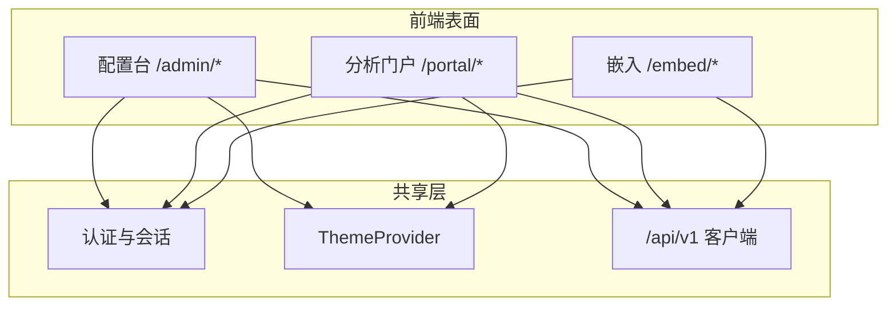

# VitalSpan — 双端壳层与信息架构（IA）

> **定位**：配置台 vs 分析门户的**壳层结构、路由与导航 IA**；颜色、组件、Token、页面模式视觉见 **b-design-system-tailadmin-radix**（`.agents/skills/b-design-system-tailadmin-radix/SKILL.md`）及 `.cursor/rules/fe-ui.mdc`。
> **行为需求**：Dashboard/权限/嵌入能力见 [PRD](../automate/prd.md)；HTTP 路由见 [api/README.md](../api/README.md)。

```yaml
version: 1.0.0
last_updated: 2026-07-03
frontend_root: fe/
design_system: .agents/skills/b-design-system-tailadmin-radix
layout_pattern_ref: references/layout-patterns/dual-portal-shell.md
```

---

## 1. 双端模型

VitalSpan 前端分为 **配置台（Admin）** 与 **分析门户（Portal）** 两套壳层，共享认证、主题与 API 客户端；第三形态 **嵌入（Embed）** 为门户的 chromeless 子集。



| 表面 | 用户 | 目标 | 壳层参考 |
|------|------|------|----------|
| **配置台 Admin** | 租户管理员、数据工程师 | 建数据源、配权限、编 Dashboard/报表、治理 | `dual-portal-shell` · Admin 列 |
| **分析门户 Portal** | 业务分析员、决策者 | 查看授权 Dashboard/报表、个人视图 | `dual-portal-shell` · User 列（简化顶栏） |
| **嵌入 Embed** | 门户/Wiki/OA 访问者 | iframe/SDK 只读展现 | `bi-share-embed` · chromeless |

**门户切换**：`UserDropdown` 底部「进入配置台」/「返回分析门户」（需双端权限）；无权限 → `403` ContentState。

---

## 2. 壳层规格（与 fe-ui 一致）

> 数值与组件实现以 **b-design-system** `templates/layout/app-layout.tsx` 为准，禁止页面内自创比例。

| 元素 | 配置台 Admin | 分析门户 Portal | 嵌入 Embed |
|------|-------------|-----------------|------------|
| 侧栏宽度 | 290px（可折叠 90px） | **无侧栏** 或 90px 极简（仅「我的」） | 无 |
| 顶栏 | 全功能 Header（搜索、通知、用户） | 简化：Logo + 全局筛选 + 用户 | 无或仅标题条 |
| 内容区 | `max-w-(--breakpoint-2xl)` 居中 | 全宽（图表优先） | 100% 宽高 |
| 侧栏持久化 key | `sidebar:admin` | `sidebar:portal` | — |
| 暗色 | 全局 `html.dark` | 同左 | 跟随父页或 `?theme=` |

**实现入口**（规划）：

```
fe/src/layouts/AdminLayout.tsx      # AppLayout + admin 导航
fe/src/layouts/PortalLayout.tsx     # 简化壳层
fe/src/layouts/EmbedLayout.tsx      # 最小 chrome
```

---

## 3. 配置台 IA（`/admin/*`）

面向 G4/G5：管理员配置平台，**不预置业务菜单**；出厂导航仅含平台能力分组。

```
/admin
├── /login                          # 认证（壳层外）
├── /                                # 运营总览（可选，dashboard.md 轻量 KPI）
│
├── 数据
│   ├── /datasources                 # 数据源列表 · crud-flow
│   ├── /datasources/new             # 新建 · form-flow
│   ├── /datasources/:id             # 详情/连通性/schema · detail-page
│   └── /connectors                  # 已注册类型只读（DS-007）
│
├── 分析构建
│   ├── /dashboards                  # Dashboard 列表 · table-list
│   ├── /dashboards/:id/edit         # 构建器 edit · bi-dashboard-builder
│   ├── /dashboards/:id/preview      # 构建器 preview
│   ├── /charts/explore              # 即席图表（三期）· bi-chart-builder
│   └── /designer                    # 查询设计器（四期）· form-composition
│
├── 报表
│   ├── /reports/templates           # 模板目录 · tree-table
│   ├── /reports/templates/:id       # 模板编辑
│   └── /reports/schedules           # 调度（三期）
│
├── 主题与实体
│   ├── /themes                      # 主题分析配置（二期）· hub-tabs
│   └── /entities/overview           # 实体总览配置（二期）
│
├── 治理
│   ├── /governance/catalog          # 接口分类（一期 PoC）
│   ├── /governance/tickets          # 工单（四期）· master-detail-ops
│   └── /governance/publish          # 发布流水线（四期）
│
├── 语义层（四期）
│   ├── /metadata/glossary
│   ├── /metadata/themes
│   └── /datasets                    # bi-dataset-management
│
└── 系统
    ├── /system/roles                # AUTH · crud-flow
    ├── /system/users                # AUTH
    ├── /system/orgs                 # AUTH
    ├── /system/rls                  # 行级权限 · form-composition
    └── /system/audit                # 审计日志 · table-list
```

### 配置台导航分组（侧栏）

| 分组 | 图标区 | 一期可用 |
|------|--------|----------|
| 数据 | 数据源、连接器 | ✅ 数据源 |
| 分析构建 | Dashboard | ✅ Dashboard 列表/编辑 |
| 报表 | 模板、调度 | 二期起 |
| 主题与实体 | 主题、实体总览 | 二期起 |
| 治理 | 分类、工单、发布 | PoC 起 / 四期完整 |
| 语义层 | 术语、Dataset | 四期 |
| 系统 | 角色、用户、权限、审计 | ✅ 角色/权限地基 |

---

## 4. 分析门户 IA（`/portal/*`）

面向 G3：消费已发布内容；默认落地页为 **角色默认 Dashboard**（FR-VIEW-3），无预装页。

```
/portal
├── /login
├── /                                 # 重定向 → 默认 Dashboard 或「我的」列表
├── /dashboards                       # 我有权访问的 Dashboard 卡片列表
├── /dashboards/:id                   # 查看模式 view · bi-dashboard-builder（只读）
├── /dashboards/:id/share             # 分享管理（有 edit 权时）· bi-share-embed
├── /reports                          # 授权报表列表
├── /reports/:id                      # 报表查看
├── /themes/:id                       # 主题分析阅读态（二期）
├── /me/views                         # 我的视图 / 覆盖（三期）· FR-VIEW-4
└── /embed/:token                     # 外链/嵌入只读（也可独立 /embed/* 路由）
```

**门户顶栏**：当前 Dashboard 标题、全局筛选器（联动）、导出/全屏（三期）、用户菜单。

**空态**：平台出厂无预装 Dashboard → ContentState「联系管理员配置数据源与仪表板」。

---

## 5. 嵌入 IA（`/embed/*`）

| 路由 | 说明 | 布局模式 |
|------|------|----------|
| `/embed/:token` | 校验 embed token 后渲染单个 Dashboard/图表 | chromeless + `ChartPanel` |
| SDK | `fe/src/sdk/` 初始化，容器内挂载 | `bi-share-embed` |

域名白名单、token 过期、撤销 → 见 PRD API-006 / VIZ-007。

---

## 6. 路由 ↔ 布局模式 ↔ PRD

| 路由（代表） | 布局模式（b-design-system） | PRD |
|-------------|---------------------------|-----|
| `/admin/datasources` | `crud-flow` + `table-list` | DS-* |
| `/admin/dashboards/:id/edit` | `bi-dashboard-builder` | DASH-*, VIZ-* |
| `/admin/system/rls` | `form-composition` | AUTH-* |
| `/portal/dashboards/:id` | `bi-dashboard-builder`（view） | DASH-*, VIEW-* |
| `/portal/dashboards/:id/share` | `bi-share-embed` | VIZ-006, API-006 |
| `/admin/governance/tickets` | `master-detail-ops` | GOV-* |
| `/admin/datasets` | `bi-dataset-management` | META-* |
| 数据大屏（可选） | `bi-data-screen` | DASH-003 |

检索路径：`pattern-index.md` → `layout-patterns/*.md` → `templates/**`。

---

## 7. 分期与导航可见性

| 里程碑 | 配置台新增导航 | 门户新增导航 |
|--------|----------------|--------------|
| M1–M6 一期 | 数据、Dashboard、系统/权限 | Dashboard 查看 |
| M7–M10 二期 | 报表、主题、实体 | 报表、主题阅读 |
| M11–M12 三期 | 图表探索、调度 | 我的视图、嵌入 |
| M13 四期 | 语义层、治理工单/发布、设计器 | 已发布查询服务入口（可选） |

未到期能力：**侧栏不展示**或标「即将推出」；禁止死链。

---

## 8. 前端目录约定（`fe/`）

与 [fe-ui.mdc](../../.cursor/rules/fe-ui.mdc) 对齐：

```
fe/src/
├── layouts/           # AdminLayout · PortalLayout · EmbedLayout
├── pages/
│   ├── admin/         # 配置台页面（*Page.tsx 路由入口）
│   └── portal/        # 分析门户页面
├── components/
│   ├── ui/            # shadcn 基元
│   ├── admin/         # 配置台复用块
│   └── portal/        # 门户复用块
├── lib/               # api · queryKeys · apiError
└── routes.tsx         # react-router v7 嵌套路由
```

写页面前必读 `fe/src/components/README.md`；视觉实现 **必须** 走 b-design-system Skill，提交前 `pnpm run check:design`。

---

## 9. 文档交叉引用

| 文档 | 内容 |
|------|------|
| [arch.md](../arch.md) | 技术栈、双端在架构图中的位置 |
| [api/README.md](../api/README.md) | 页面调用的 HTTP 路由 |
| [automate/plan.md](../automate/plan.md) | 当前里程碑决定导航可见性 |
| b-design-system `dual-portal-shell.md` | 双门户壳层矩阵（通用） |
| b-design-system `bi-dashboard-builder.md` | Dashboard 三模式 edit/preview/view |

---

## 修订记录

| 版本 | 日期 | 说明 |
|------|------|------|
| 1.0.0 | 2026-07-03 | 初版：Admin/Portal/Embed 双端 IA 与壳层约定 |
