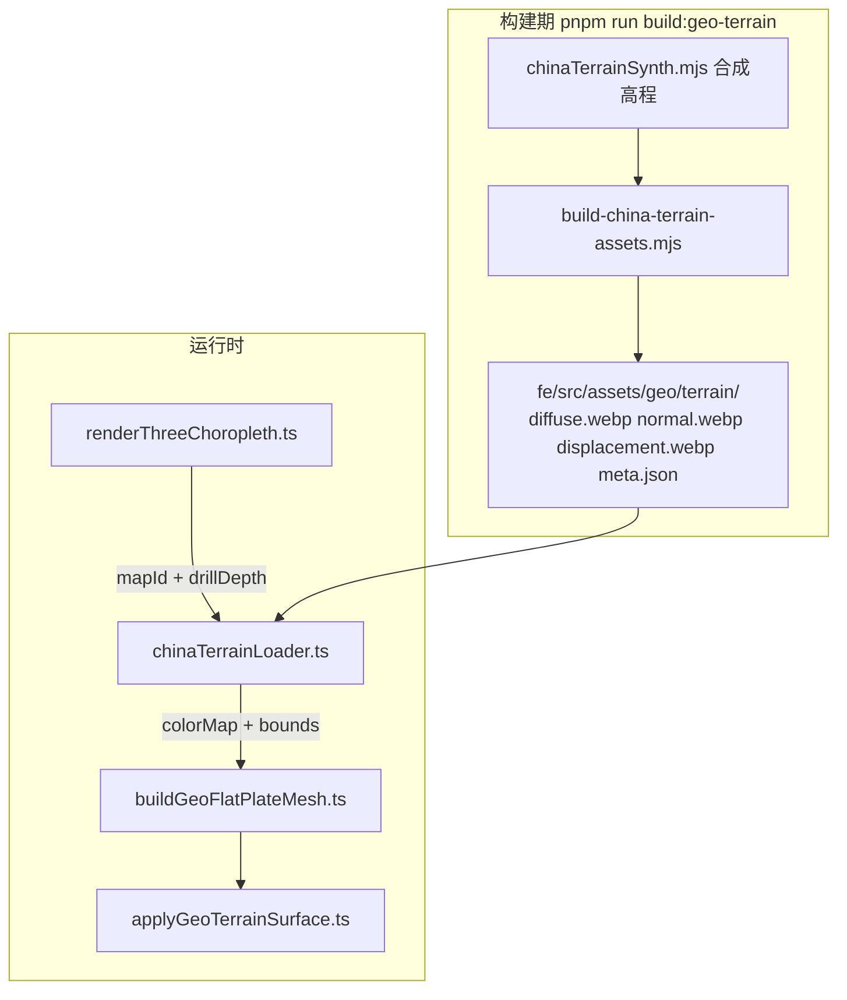

# VitalSpan 地图纹理实现说明

> **范围**：仅 **3D 区域地图（`map-3d`）** 使用离线 hillshade 位图纹理；2D `map` 与热力图无地形纹理。  
> **合规**：GEO-IRON-01 — 禁止在线瓦片 / 地图 Key；资产须打包在 `fe/src/assets/geo/`。  
> **关联**：架构 [ADR-12](../arch.md#adr-12-离线中国地图geo-iron-01) · PRD [VIZ-003](../automate/prd/F06-VIZ.md#viz-003-图表类型插件注册)

---

## 前置条件（WebGL）

hillshade 纹理 **仅在 3D 渲染成功时** 生效。在 DevTools 检查图表容器 `[data-testid="three-map-chart"]`：

| `data-render-engine` | 含义 |
|----------------------|------|
| `three` | Three.js 3D 已启动，可显示 hillshade |
| `d3-fallback` | 已降级 2D SVG，**无纹理** |
| `pending` | 加载中 |

若出现降级横幅，先解决 WebGL，再排查纹理：

- Chrome：`设置 → 系统 → 使用硬件加速` 须开启；访问 `chrome://gpu` 确认 WebGL 非 Disabled
- `data-fallback-reason="webgl-unavailable"`：无法创建 WebGL 上下文
- `data-fallback-reason="three-init-failed"`：Three 初始化异常
- `data-fallback-reason="quality-degraded"`：区县级或要素过多自动降级 2D

探测逻辑见 `fe/src/components/charts/engine/three/webglProbe.ts`（`webgl2` / `webgl` + `failIfMajorPerformanceCaveat: false`）。

---

## 结论先行

| 图表类型 | 是否有「纹理」 | 实现方式 |
|---------|---------------|---------|
| **2D 区域地图 `map`** | 否 | D3/SVG 纯色 choropleth + visualMap 渐变色 |
| **3D 区域地图 `map-3d`** | 是（可选） | 离线 WebP hillshade 贴在各省 **Extrude 顶面** |
| **热力图 `heatmap` / `t-heatmap`** | 否 | 矩阵色块，与地形无关 |

3D 纹理受 Inspector 两个开关控制（`ChartGeoStylePanel.tsx`）：

- `geo3d.terrainTexture` — 是否加载 hillshade 资产（默认开）
- `geo3d.terrainRelief` — 是否启用法线/位移凹凸（默认开；需先开 terrainTexture）

门控逻辑在 `renderThreeChoropleth.ts`：

```typescript
const terrainOn = terrainTextureOn;
const reliefOn = terrainTextureOn && terrainReliefOn;
```

---

## 整体数据流（仅 map-3d）



---

## 1. 资产生成（离线，GEO-IRON-01 合规）

**入口命令**：`pnpm run build:geo-terrain`（`fe/package.json`）

**脚本**：

- `fe/scripts/build-china-terrain-assets.mjs` — 编排输出目录
- `fe/scripts/lib/chinaTerrainSynth.mjs` — 核心算法

**高程来源（当前默认）**：**程序化合成**，不是在线 DEM/CDN。`sampleElevation(lng, lat)` 用 ridged noise + fBM + 西部抬升/盆地微调生成 0~1 高度场。脚本注释写明可选传入 Natural Earth GeoTIFF 作为第二参数替换合成（需自行扩展脚本）。

**每个地形包输出三张贴图 + meta**：

| 文件 | 含义 | 生成方式 |
|------|------|---------|
| `diffuse.webp` | **hillshade 彩色底图**（实际渲染用的唯一贴图） | 高程 → 315°/42° 光照 hillshade → 蓝灰 relief 着色 |
| `normal.webp` | 法线贴图 | 高度梯度 → RGB 法线 |
| `displacement.webp` | 置换高度图 | 高度灰度 |

**meta.json** 示例（`national/meta.json`）：

```json
{ "bounds": [73, 17, 136, 54], "size": 1024 }
```

`bounds` = `[west, south, east, north]` 经纬度范围，供 UV 映射。

**分级覆盖**（`manifest.ts`）：

- **L0 全国**：`terrain/national/`，1024×1024，中国 bbox
- **L1 省级试点**（下钻后懒加载）：440000 广东、510000 四川、110000 北京、310000 上海，768×768，bbox 从 `china-provinces.json` 该省 geometry 计算

---

## 2. 运行时加载

`chinaTerrainLoader.ts`：

1. `resolveTerrainPackKey(mapId, drillDepth)` 决定用哪一包：
   - `drillDepth === 0` 或 `mapId === vs-regions` → **national**
   - `mapId === vs-geo-{adcode}` 且 adcode 在试点列表 → **province**
   - 否则回退 national
2. `THREE.TextureLoader` 加载 WebP（`flipY: false`，ClampToEdge）
3. 按 `level:adcode` **内存缓存**；失败时整包回退全国

**材质分支**：

- **`terrainRelief` 关**：顶面 `MeshBasicMaterial + diffuse`（不受光照影响，hillshade 最稳）
- **`terrainRelief` 开** 且 normal 可用：`MeshStandardMaterial` 接 `map + normalMap + displacementMap`
- 加载失败时回退 national；DEV 下容器角提示「地形贴图加载失败」

---

## 3. 贴到省面 mesh 上（核心渲染）

3D 地图不用「整片方形底图」（该方案已回滚，避免 Z-fighting）。当前正确做法：

### 3.1 几何

`buildGeoFlatPlateMesh.ts`：

- 每个省/市/区县 polygon → `THREE.ExtrudeGeometry` 薄板（`depth` 由 `extrudeIntensity` 控制）
- **顶面 cap**（materialIndex 1）贴纹理；**侧面** 用纯色 `MeshStandardMaterial`

### 3.2 UV 映射

`applyGeoTerrainSurface.ts` 的 `applyTerrainToExtrudeGeometry`：

- 遍历 cap 顶点 `(x, y, z≈depth)`
- 优先：`projection.invert(screenPx, screenPy)` → 经纬度 → 按 `geoBounds` 归一化为 `[u,v]`
- 失败时：按 `projBounds` 平面 fallback
- 目标：让 hillshade 栅格（经纬度 bbox）与 Mercator 投影后的省界 **尽量对齐**

已知限制（代码注释）：Mercator mesh vs 经纬度栅格纹理存在 **轻微错位**，未做投影空间重采样。

### 3.3 材质与数据色混合

`computeCapTintColor` + 两种 cap 材质：

```typescript
// hillshade 为主：tintMix = 0.08 + valueT * 0.22；dark 主题再保底提亮
const color = computeCapTintColor(dataTint, valueT, isDark);

// 仅 hillshade（terrainRelief 关）
new THREE.MeshBasicMaterial({ map: diffuse, color });

// hillshade + 凹凸（terrainRelief 开）
new THREE.MeshStandardMaterial({
  map: diffuse, normalMap, displacementMap, displacementScale,
  color, emissive: color,
});
```

- `dataTint` / `valueT` 来自指标值 → `colorForValue`（`geoSurfaceColors.ts`）同一套 visualMap 色带
- **无纹理时**：退化为 `MeshStandardMaterial` 纯色/emissive 顶面

### 3.4 编排入口

`renderThreeChoropleth.ts`（约 L153–217）：

- 下钻换 `mapId` → 重新 `loadChinaTerrainPack` → 各省 loop 调用 `buildGeoFlatPlateMesh(..., terrainOpts)`
- 销毁时 `terrainPack.dispose()` 释放 GPU 纹理

---

## 4. 2D 地图「看起来像底图」的部分（不是纹理）

`renderChoropleth.ts`：

- 离线 GeoJSON（`OfflineGeoPort.ts`）+ `fitChinaGeoProjection`
- 省界 `path` 用 `colorForGeoValue` 填色、`geoPlotBackground` 作背景
- 可选 `mountGeoChoroplethAtmosphere` 轮廓光晕（矢量效果，非位图纹理）

**没有任何 `TextureLoader` 或 WebP 参与 2D 路径。**

---

## 5. 与 DataEase / 在线地图的边界

按 `.cursor/rules/geo-map-offline-china.mdc`：

- 禁止在线瓦片、Mapbox、高德等
- 地形资产必须打包在 `fe/src/assets/geo/` 或通过平台 API 分发（当前为仓库内置 WebP）
- PRD 记录见 `docs/automate/prd/F06-VIZ.md` VIZ-003 演化建议

---

## 6. 扩展与调试

| 目标 | 操作 |
|------|------|
| 重新生成全国/试点省贴图 | `cd fe && pnpm run build:geo-terrain` |
| 新增省下钻 L1 贴图 | 在 `PILOT_PROVINCE_ADCODES` 加 adcode，重跑脚本 |
| 接入真实 DEM | 扩展 `build-china-terrain-assets.mjs` 读 GeoTIFF 替换 `buildHeightGrid` |
| 启用 normal/displacement 真实起伏 | Inspector 开启「地形凹凸」；`buildGeoFlatPlateMesh` 已接 Standard 材质 |
| 关闭 3D 纹理 | Inspector 关闭「地形贴图」 |
| 仅关凹凸、保留 hillshade | 关闭「地形凹凸」，保持「地形贴图」开 |

---

## 关键文件索引

| 环节 | 路径 |
|------|------|
| 资产生成 | `fe/scripts/build-china-terrain-assets.mjs` · `fe/scripts/lib/chinaTerrainSynth.mjs` |
| 资产目录 | `fe/src/assets/geo/terrain/` |
| 加载器 | `fe/src/components/charts/engine/three/geo/chinaTerrainLoader.ts` |
| UV + 材质 | `fe/src/components/charts/engine/three/geo/applyGeoTerrainSurface.ts` |
| Mesh 构建 | `fe/src/components/charts/engine/three/buildGeoFlatPlateMesh.ts` |
| 3D 入口 | `fe/src/components/charts/engine/three/renderThreeChoropleth.ts` |
| 2D 无纹理 | `fe/src/components/charts/engine/d3/geo/renderChoropleth.ts` |
