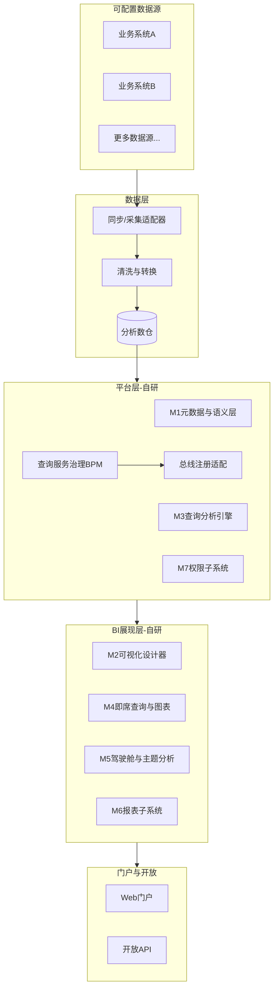

# 自研 BI 分析平台需求规格说明书

> **文档版本**：V3.6（前后端技术栈已定）  
> **前端技术栈（已定）**：React · shadcn/ui · Radix Primitives · Tailwind CSS v4  
> **后端技术栈（已定）**：FastAPI（Python）  
> **产品定位**：对标 [DataEase](https://dataease.io/) / [Apache Superset](https://superset.apache.org/) 能力的**自研 BI 分析平台**  
> **建设原则**：BI 层全部自研；Superset / DataEase 仅作功能与交互参考，**不作为运行时依赖**  
> **参考文档**：[附录 S 户户通需求实例](附录S-参考场景户户通.md)（**仅文档参考**，不参与运行时加载）  
> **关联附录**：[附录 D 报表需求实例](附录D-报表规格清单.md) · [附录 E 查询接口能力模板](附录E-7类查询接口清单.md) · [附录 F 实施追溯矩阵](附录F-实施追溯矩阵.md) · [演化里程碑 plan.md](automate/plan.md)  
> **参考环境（可选）**：本地 Superset `8088`、DataEase `8100` 仅作产品走查，非 PoC 前置条件

---

## 1. 项目概述

### 1.1 产品定位与对标

**交付物** = 自研 BI 分析平台，在能力与交互上对标 DataEase / Superset：


| 原则     | 说明                                                               |
| ------ | ---------------------------------------------------------------- |
| 运行时零依赖 | 不嵌入、不 fork、不部署 Superset/DataEase 作为生产组件                          |
| 设计时强对标 | 数据集、Explore/图表配置、仪表板、行级权限、定时报告等以二者为走查基准                          |
| 纯平台交付  | 连接数据库 → **配置图表/仪表板**（绑定 SQL 或物理表）→ 前端展示；**数据集（Dataset）配置层暂不建设**  |
| 范围裁剪   | **一至三期不做** DataEase/Superset 式「数据集」管理；**四期**交付 M1 完整语义层与 Dataset |


**自研模块与对标映射**：


| 自研模块       | 对标能力                                  | 说明               |
| ---------- | ------------------------------------- | ---------------- |
| M1 元数据/语义层 | Superset Dataset / DataEase 数据集       | 物理表→业务字段、计算字段、指标 |
| M2 可视化设计器  | Superset Explore / DataEase 图表配置      | 拖拽维度/指标/筛选       |
| M3 查询引擎    | Superset SQL 生成 / DataEase 查询引擎       | 配置→SQL/API       |
| M4 即席+图表   | Superset Chart types / DataEase 仪表板组件 | 类型+样式+联动         |
| M5 驾驶舱/主题  | DataEase 仪表板+地图 / Superset Dashboard  | 预制页=默认 Dashboard |
| M6 报表      | DataEase 定时报告 / Jasper 思路             | 模板+调度+导出         |
| M7 权限      | Superset RLS / DataEase 行权限           | RBAC + 行过滤谓词     |
| M8 查询治理    | **平台扩展**（DE/SS 无完整对标）                 | 工单+总线注册          |


**行业扩展能力**（平台差异化；户户通等实例见附录 S **参考文档**）：

- 查询服务治理 BPM + 数据交换总线注册（FR-1.x）
- 可配置多维权限（含实体生命周期等自定义维度类型）
- GIS/热力等地图类组件（对标 DataEase 区域地图）

### 1.2 建设目标

建设一套**可配置的自研 BI 分析平台**，实现：

- 可配置数据源接入（MySQL、PostgreSQL 等）
- 仪表板、主题分析、报表、即席查询等 BI 展现能力（**图表直接绑定数据源查询**，不经 Dataset 层）
- 查询服务治理（申请→审批→设计→发布→总线注册）
- 可配置 RBAC 与行级权限；角色由管理员配置；支持角色默认视图与用户自定义

### 1.3 系统边界




**说明**：图中所有模块均为**自研建设**；Superset / DataEase 不参与生产部署，仅用于功能对标（见附录 B）。

### 1.4 自研 BI 平台模块划分


| 模块编号 | 模块名称      | 职责                         | 参考借鉴                                   |
| ---- | --------- | -------------------------- | -------------------------------------- |
| M1   | 元数据与语义层   | 业务术语、主题树、**Dataset（四期）**   | DataEase 数据集；Superset Dataset          |
| M2   | 可视化查询设计器  | 拖拽配置查询条件、运算规则、输出字段         | DataEase 图表配置；Superset Explore         |
| M3   | 查询分析引擎    | 配置入库、配置→SQL/API 生成、执行查询    | Superset 查询生成；DataEase 查询引擎            |
| M4   | 即席查询与图表插件 | 可扩展图表类型与样式；门户嵌入            | ECharts/AntV；DataEase 仪表板；Superset Viz |
| M5   | 驾驶舱与主题分析  | 可配置 Dashboard、GIS、时间域、筛选联动 | DataEase 区域地图/热力；Superset Dashboard 联动 |
| M6   | 报表子系统     | 可配置报表、Word/Excel 模板、调度推送   | DataEase 定时报告；Jasper 模板思路              |
| M7   | 权限子系统     | 可配置 RBAC + 多维行级权限          | DataEase 行权限 UI；Superset RLS           |
| M8   | 查询服务治理    | 工单流程、发布流水线、总线注册            | 平台自研扩展                                 |


**模块依赖顺序**（技术先后，**不等同于** §8 交付期次）：


| 顺序  | 模块组合         | 说明                               |
| --- | ------------ | -------------------------------- |
| 1   | M7           | 权限地基；一期交付                        |
| 2   | M5 + M6      | Dashboard/报表；图表**直连数据源查询**（一至三期） |
| 3   | M4 + M2      | 即席图表与设计器（三期起）                    |
| 4   | M1 + M3 + M8 | **Dataset 语义层**、查询引擎、治理闭环（四期）    |


> **范围说明**：M1「数据集配置」整体安排在**四期**；一至三期图表通过 `dataSourceId` + SQL/物理表绑定数据，不经过 Dataset 抽象层。

> **与 §8 的对齐说明**：M6 首包交付安排在二期（非一期）。§8 为权威交付分期；本节仅描述模块间技术依赖。

---

## 2. 用户角色模型（平台机制，不预置业务角色）

平台**不预置、不限制**业务角色清单。所有角色由**租户管理员在平台内**定义、命名并分配；不同部署可有完全不同的角色体系。**平台不提供场景包加载机制**，附录 S 仅为需求参考文档。


| 机制               | 说明                                                     |
| ---------------- | ------------------------------------------------------ |
| **RoleRegistry** | 管理员注册角色 `code`、显示名、描述                                  |
| **用户绑定**         | 用户 ↔ 角色（多对多）；可叠加可配置组织树                                 |
| **权限绑定**         | 角色 ↔ M7 数据域规则 ↔ 资源（数据源、Dashboard、报表、工单节点）              |
| **视图绑定**         | 角色 ↔ 默认 Dashboard/报表集合（FR-VIEW-3）；用户可在权限内覆盖（FR-VIEW-4） |
| **流程绑定**         | M8 工单各节点绑定「具备某权限/角色的参与者」，由管理员配置                        |


**平台不提供**固定角色表。附录 S §5 所列户户通角色仅为**参考配置示例**，需管理员手工在平台中创建，不会自动导入。

**技术标识（非业务角色）**：可选 `system-operator` 用于系统级配置；与业务 RBAC 隔离。


| 参考借鉴                                  | 实现要点                       |
| ------------------------------------- | -------------------------- |
| DataEase 组织 + 角色 + 资源授权               | 角色与资源授权可配置                 |
| Superset Role + Permission on objects | 角色与 Dataset/Dashboard 访问绑定 |


---

## 3. 功能需求

> 各功能需求标注 **自研模块**（M1~M8）、**参考借鉴**（Superset / DataEase）。附录 S/D 为**需求参考实例**，非运行时模块。

### 3.1 查询服务管理

#### FR-1.1 查询服务接口与数据交换总线对接


| 项目       | 内容                                           |
| -------- | -------------------------------------------- |
| **需求编号** | FR-1.1                                       |
| **自研模块** | M3、M8                                        |
| **优先级**  | P0                                           |
| **需求描述** | 支持**可配置的多类**查询接口分类；将已发布接口对接数据交换共享总线，统一提供查询服务 |
| **输入**   | 各数据源已有接口清单、统计分析需求                            |
| **输出**   | 分类查询接口在总线注册并可被外部系统调用                         |
| **业务规则** | 接口需有统一语法描述（OpenAPI）；仅支持查询类（非写入）              |
| **参考借鉴** | Superset REST API 资源组织；OpenAPI 描述规范          |
| **参考实例** | 附录 E 七分法模板（附录 S §9 为户户通 API 命名参考）            |


---

#### FR-1.2 流程化查询请求申请


| 项目       | 内容                                          |
| -------- | ------------------------------------------- |
| **需求编号** | FR-1.2                                      |
| **自研模块** | M8                                          |
| **优先级**  | P0                                          |
| **需求描述** | **可配置工单流程**：流程模板、节点、参与角色均由管理员定义（不限定角色数量与名称） |
| **表单字段** | 可配置（如数据内容、查询范围、展现形式、业务说明）                   |
| **参考借鉴** | 通用 BPM（Superset/DataEase 均无，平台自研）           |
| **参考实例** | 附录 S §5.2 户户通工单角色配置示例（管理员手工配置）              |


> 各状态迁移的**参与角色**由流程配置指定，平台不硬编码角色名。

---

#### FR-1.3 可视化查询分析能力设计工具


| 项目       | 内容                                                         |
| -------- | ---------------------------------------------------------- |
| **需求编号** | FR-1.3                                                     |
| **自研模块** | M2、M1                                                      |
| **优先级**  | P0                                                         |
| **需求描述** | 具备设计权限的角色通过可视化配置完成查询设计，支持数学运算规则维护                          |
| **运算能力** | 加、减、乘、除、求和、求平均                                             |
| **配置项**  | 查询条件、输出字段、聚合规则、过滤条件                                        |
| **参考借鉴** | DataEase 计算字段 + 图表拖拽；Superset Explore + Calculated Columns |


---

#### FR-1.4 流程化查询服务发布


| 项目       | 内容                               |
| -------- | -------------------------------- |
| **需求编号** | FR-1.4                           |
| **自研模块** | M8、M3                            |
| **优先级**  | P0                               |
| **需求描述** | 设计完成后经发布审批，自动创建接口并注册总线，通知申请人     |
| **核心能力** | 配置项与接口语法自动映射；接口实现逻辑自动生成          |
| **参考借鉴** | Superset Dataset/Chart 程序化创建 API |


---

#### FR-1.5 数据查询分析引擎


| 项目       | 内容                                                     |
| -------- | ------------------------------------------------------ |
| **需求编号** | FR-1.5                                                 |
| **自研模块** | M3、M1                                                  |
| **优先级**  | P0                                                     |
| **需求描述** | 存储元模型与配置实例；根据配置 + 数仓生成可发布查询接口                          |
| **工作过程** | 可视化配置 → 配置入库 → 引擎读取配置 + 数仓 → 输出查询服务                    |
| **参考借鉴** | Superset Virtual Dataset + Metrics；DataEase 数据集 SQL 生成 |
| **实现要点** | 配置 JSON/DSL → SQL 翻译器 → 参数化执行 → RLS 注入 → 结果集/API       |


---

#### FR-1.6 数据访问权限控制


| 项目              | 内容                                     |
| --------------- | -------------------------------------- |
| **需求编号**        | FR-1.6                                 |
| **自研模块**        | M7                                     |
| **优先级**         | P0                                     |
| **需求描述**        | **可配置多维行级权限**：管理员定义权限维度类型与分组，关联角色，分配用户 |
| **模型**          | 权限维度 → 维度分组 → 关联角色 → 用户分配角色            |
| **内置维度类型（可扩展）** | 物理对象（表/视图）、地域层级、时间范围、自定义业务维度（如生命周期阶段）  |


| 参考借鉴                            | 实现要点            |
| ------------------------------- | --------------- |
| DataEase 行权限规则配置 UI（角色/用户/系统变量） | 管理端可视化配置权限规则    |
| Superset RLS：查询执行前注入 WHERE 条件   | M3 执行前合并权限谓词    |
| —                               | 权限规则与 M8 发布流程联动 |


> **参考实例**：附录 S §5 户户通角色与权限配置示例。

---

### 3.2 即席查询与图表

#### FR-2.0 数据源连接（一至三期）


| 项目       | 内容                                          |
| -------- | ------------------------------------------- |
| **需求编号** | FR-2.0                                      |
| **自研模块** | 数据连接层、M7                                    |
| **优先级**  | P0                                          |
| **需求描述** | 管理员配置数据源连接（MySQL、PostgreSQL 等）：主机、库名、凭证、连接池 |
| **输出**   | 可测试连通的 `dataSourceId`；M7 控制可见数据源            |
| **参考借鉴** | DataEase 数据源管理；Superset Database 连接         |
| **明确不做** | 本阶段**不建设** Dataset 配置 UI（字段映射、计算字段、指标层）     |


---

#### FR-2.0b 图表直连查询绑定（一至三期过渡）


| 项目       | 内容                                                            |
| -------- | ------------------------------------------------------------- |
| **需求编号** | FR-2.0b                                                       |
| **自研模块** | M4、M5、M3（轻量查询执行）                                              |
| **优先级**  | P1                                                            |
| **需求描述** | 图表/仪表板组件绑定 `dataSourceId` + **SQL 或物理表/视图** 获取数据；不经 Dataset 层 |
| **配置项**  | `dataSourceId`、`querySql` 或 `tableName`、维度/指标字段映射（组件级）        |
| **四期迁移** | M1 Dataset 上线后，可将绑定迁移为 `datasetId`                            |
| **参考借鉴** | Superset SQL Lab + Chart；DataEase 简易表绑定                       |


---

#### FR-2.1 图表插件与可视化类型


| 项目              | 内容                                             |
| --------------- | ---------------------------------------------- |
| **需求编号**        | FR-2.1                                         |
| **自研模块**        | M4                                             |
| **优先级**         | P1                                             |
| **需求描述**        | 可扩展图表类型与样式子类型；支持维度、指标、筛选、时间范围配置                |
| **图表类型（平台最小集）** | 折线、柱状、饼图、仪表盘、表格、地图（含热力）等，对标 Superset viz types |
| **样式子类型**       | 堆叠/分组、面积、环形、玫瑰图等，对标 DataEase 图表样式              |
| **配置项**         | 图表类型、样式、X/Y 轴维度、指标、筛选器、时间范围                    |
| **集成要求**        | iframe / SDK 嵌入门户                              |
| **参考借鉴**        | DataEase 仪表板图表组件；Superset Explore 图表切换与配置面板    |
| **技术选型建议**      | ECharts 或 AntV；统一 ChartConfig 协议（见 FR-VIEW）    |


---

#### FR-2.2 通用查询工具（四期，含 Dataset）


| 项目        | 内容                                  |
| --------- | ----------------------------------- |
| **需求编号**  | FR-2.2                              |
| **自研模块**  | M1、M2、M4                            |
| **优先级**   | P4（**四期**；一至三期由 FR-2.0b 直连查询替代）     |
| **需求描述**  | 语义层 + Dataset + 可视化拖拽查询 + 传统 SQL 模式 |
| **数据源范围** | 已授权 Dataset（M1）与底层数据源（M7）           |
| **查询模式**  | 可视化拖拽 + SQL/存储过程                    |


| 子模块   | 需求要点            | 参考借鉴                                   |
| ----- | --------------- | -------------------------------------- |
| 语义层   | 表字段按业务主题重组为业务对象 | Superset Virtual Dataset；DataEase 字段映射 |
| 数据模型  | 物理名翻译为业务术语      | 两者 Dataset 元数据面板                       |
| 业务主题  | 主题→对象→属性树形结构    | M1 主题树元模型                              |
| 可视化查询 | 拖拽、嵌套复用         | DataEase 查询组件；Superset Explore         |
| 传统查询  | SQL/存储过程        | Superset SQL Lab                       |


---

### 3.3 用户视图与图表配置（FR-VIEW）

#### FR-VIEW-1 Dashboard 与视图模型


| 项目        | 内容                                                     |
| --------- | ------------------------------------------------------ |
| **需求编号**  | FR-VIEW-1                                              |
| **自研模块**  | M5、M4                                                  |
| **优先级**   | P1（数据模型一期预留；完整编辑三期）                                    |
| **需求描述**  | 全 BI 页面（驾驶舱、主题分析、报表展现、即席）均基于可配置 **DashboardView**      |
| **核心模型**  | `DashboardView`：布局 + 组件列表 + 全局筛选器                      |
| **预制页定位** | 管理员配置的 **defaultViewId** 或用户保存的视图；平台出厂为空，无预装 Dashboard |
| **参考借鉴**  | Superset Dashboard；DataEase 仪表板                        |


---

#### FR-VIEW-2 图表配置协议（ChartViewConfig）


| 项目       | 内容                                                                                                                               |
| -------- | -------------------------------------------------------------------------------------------------------------------------------- |
| **需求编号** | FR-VIEW-2                                                                                                                        |
| **自研模块** | M4、M5                                                                                                                            |
| **优先级**  | P1（三期完整；一期协议预留）                                                                                                                  |
| **需求描述** | 统一描述单图配置：类型 + 样式 + 维度 + 指标 + 筛选                                                                                                  |
| **字段**   | `chartType`、`styleVariant`、`dimensions[]`、`metrics[]`、`filters[]`；一至三期用 `dataSourceId`+`querySql`/`tableName`，四期起可改用 `datasetId` |
| **参考借鉴** | Superset chart metadata；DataEase 图表属性面板                                                                                          |


---

#### FR-VIEW-3 角色默认模板（RoleTemplate）


| 项目       | 内容                                            |
| -------- | --------------------------------------------- |
| **需求编号** | FR-VIEW-3                                     |
| **自研模块** | M7、M5                                         |
| **优先级**  | P2                                            |
| **需求描述** | 管理员按角色绑定默认 Dashboard/报表/图表集合                  |
| **规则**   | 管理员为角色绑定默认 Dashboard/报表；新用户继承所属角色默认           |
| **参考借鉴** | DataEase 组织与资源授权；Superset Role + Dashboard 访问 |


---

#### FR-VIEW-4 用户视图覆盖（UserOverride）


| 项目       | 内容                                           |
| -------- | -------------------------------------------- |
| **需求编号** | FR-VIEW-4                                    |
| **自研模块** | M5、M4、M7                                     |
| **优先级**  | P3                                           |
| **需求描述** | 用户在权限内自定义/保存个人视图（「我的仪表板」）                    |
| **硬边界**  | 用户自定义不得突破 M7 数据权限；不可访问未授权数据源                 |
| **参考借鉴** | Superset 用户保存 chart/dashboard；DataEase 个人仪表板 |


---

### 3.4 统计报表

#### FR-3.1 预制分析报表体系


| 项目       | 内容                                        |
| -------- | ----------------------------------------- |
| **需求编号** | FR-3.1                                    |
| **自研模块** | M5、M6                                     |
| **优先级**  | P1                                        |
| **需求描述** | 支持按**可配置实体**定义生命周期状态/活动分析报表页              |
| **能力**   | N 实体 × M 分析类型；维度字典驱动；M6 预制页 + M3 绑定指标 SQL |
| **参考实例** | 附录 S §3.2 五实体分析需求示例                       |


---

#### FR-3.2 自定义报表工具


| 项目       | 内容                       |
| -------- | ------------------------ |
| **需求编号** | FR-3.2                   |
| **自研模块** | M6                       |
| **优先级**  | P1                       |
| **子模块**  | 报表引擎、模板定义、模板管理、模板调度、外部接口 |


| 子功能  | 需求要点                       | 参考借鉴                              |
| ---- | -------------------------- | --------------------------------- |
| 报表引擎 | 模板 + 数据渲染 → Web 展现         | DataEase 仪表板渲染；Superset Dashboard |
| 模板定义 | Word/Excel/PDF；嵌 SQL/表格/图形 | JasperReports 封装                  |
| 模板管理 | 树形目录；增删改查、另存、手工执行          | DataEase 目录结构                     |
| 模板调度 | 日/周/月/组合调度                 | DataEase 定时报告；Superset Reports    |
| 外部接口 | 按模板/时间提取报告文档               | REST API                          |


---

### 3.5 主题分析

#### FR-4.1 可配置实体主题分析


| 项目       | 内容                                |
| -------- | --------------------------------- |
| **需求编号** | FR-4.1                            |
| **自研模块** | M5                                |
| **优先级**  | P1                                |
| **需求描述** | 按实体类型配置时间域与空间域（GIS）主题分析页          |
| **时间域**  | 可配置粒度：日/周/月/同比环比等                 |
| **空间域**  | GIS 分布 + 节点统计 + 行政区划下钻            |
| **参考借鉴** | DataEase 区域地图、热力、下钻；Superset 跨图联动 |
| **参考实例** | 附录 S §3.3 主题分析需求示例                |


---

### 3.6 数据接入（平台 · 本期范围外）

> **本期不做**：下列 FR 保留为**远期扩展**，当前建设路径为 **FR-2.0 直连数据库查询**（见 §3.2），不实施 OGG/数仓同步管道。

#### FR-DATA 可配置数据源同步（范围外）


| 项目       | 内容                         |
| -------- | -------------------------- |
| **需求编号** | FR-DATA                    |
| **状态**   | **本期不做**                   |
| **需求描述** | 配置化接入多个源系统，同步至分析数仓         |
| **参考实例** | 附录 S §2.3（户户通多源同步需求，仅文档参考） |


#### FR-ETL 数据清洗与转换（范围外）


| 项目       | 内容                |
| -------- | ----------------- |
| **需求编号** | FR-ETL            |
| **状态**   | **本期不做**          |
| **需求描述** | 可配置清洗作业：格式转换、属性补充 |
| **参考实例** | 附录 S §2.4         |


---

### 3.7 实体总览与 Dashboard 优化（平台）

#### FR-6.1 可配置 Dashboard


| 项目       | 内容                                        |
| -------- | ----------------------------------------- |
| **需求编号** | FR-6.1                                    |
| **自研模块** | M5                                        |
| **优先级**  | P1                                        |
| **需求描述** | 提供可配置 Dashboard 容器：地图、热力、排名、KPI、时间轴等组件可插拔 |
| **交付**   | M5 Dashboard 引擎 + 组件库；出厂无预装页面，由管理员配置      |
| **参考借鉴** | DataEase 仪表板；Superset Dashboard           |
| **参考实例** | 附录 S §6 驾驶舱配置需求示例                         |


---

#### FR-6.2 实体总览页


| 项目       | 内容                             |
| -------- | ------------------------------ |
| **需求编号** | FR-6.2                         |
| **自研模块** | M5、M1                          |
| **优先级**  | P1                             |
| **需求描述** | 可配置实体总览页：统计卡片、详情筛选、实体关系查询、区域下钻 |
| **能力**   | 实体模型驱动；跨组件口径一致性校验              |
| **参考实例** | 附录 S §7 实体总览需求示例               |


---

#### FR-6.3 / FR-6.4 报表扩展配置


| 项目       | 内容                                      |
| -------- | --------------------------------------- |
| **需求编号** | FR-6.3、FR-6.4                           |
| **自研模块** | M6                                      |
| **优先级**  | P1                                      |
| **需求描述** | 平台支持调整既有报表指标/筛选器、批量新增报表（均由管理员配置）        |
| **参考实例** | 附录 S §8、[附录 D](附录D-报表规格清单.md) 户户通报表需求示例 |


---

### 3.8 权限优化

#### FR-8.1 可配置 RBAC 与分域权限


| 项目       | 内容                                                      |
| -------- | ------------------------------------------------------- |
| **需求编号** | FR-8.1                                                  |
| **自研模块** | M7                                                      |
| **优先级**  | P0                                                      |
| **需求描述** | **角色体系由管理员完全自定义**：可增删角色、组织树、数据域规则；平台不限制角色类型与数量          |
| **验收**   | 按已配置角色集完成越权 smoke test                                  |
| **参考借鉴** | DataEase 组织树 + 行权限 + 系统变量；Superset User Attribute + RLS |
| **参考实例** | 附录 S §5 户户通角色配置示例                                       |


---

## 4. 非功能需求


| 编号     | 类别   | 要求                                  |
| ------ | ---- | ----------------------------------- |
| NFR-01 | 性能   | Dashboard 首屏 ≤ 5s；报表查询 ≤ 10s（基线可配置） |
| NFR-02 | 可用性  | 核心看板可用性 ≥ 99.5%                     |
| NFR-03 | 安全   | HTTPS；敏感字段脱敏；操作审计日志                 |
| NFR-04 | 扩展性  | 新增实体类型、报表、数据源类型不改核心框架               |
| NFR-05 | 兼容性  | 主流浏览器；企微/钉钉消息推送                     |
| NFR-06 | 国产化  | 信创 DB/OS（按需）                        |
| NFR-07 | 嵌入   | iframe / SDK 嵌入门户                   |
| NFR-08 | 自主可控 | BI 层无 Superset/DataEase 运行时依赖       |


---

## 5. 数据需求（平台）

### 5.1 可配置实体模型

平台通过 M1 管理**实体类型**定义：属性 schema、生命周期阶段、关联关系。由管理员在平台内配置。

> **参考实例**：附录 S §3 五类实体需求示例。

### 5.2 维度字典配置机制（四期，随 M1 Dataset）

> **一至三期**：筛选维度在图表组件级配置（`ChartViewConfig.filters`），不建设全局维度字典管理。


| 机制  | 说明                            |
| --- | ----------------------------- |
| 注册  | 四期起，管理员在 M1 注册维度 code、显示名、枚举值 |
| 绑定  | 维度绑定至 Dataset 字段或计算列          |
| 消费  | M4/M5/M6 统一引用维度 code          |


> **参考实例**：附录 S §4 维度枚举需求示例（实施时可在组件级手工配置）。

### 5.3 数据流（平台抽象）

```
可配置数据源 → M7 授权 → 图表直连查询(FR-2.0b) → M5/M6 展现
（四期）→ M1 Dataset → M2/M3/M8 完整闭环
```

---

## 6. 接口需求


| 编号    | 接口       | 方向  | 自研模块  | 说明                      |
| ----- | -------- | --- | ----- | ----------------------- |
| IF-01 | 数据交换总线注册 | 对外  | M8    | 已发布查询接口自动注册             |
| IF-02 | 查询服务 API | 对外  | M3    | 配置生成的标准查询接口             |
| IF-03 | 报表文档 API | 对外  | M6    | 按模板/时间提取 Word/PDF/Excel |
| IF-04 | 门户嵌入     | 对内  | M4/M5 | iframe / SDK            |
| IF-05 | 数据源同步    | 对内  | 数据层   | 可配置源系统入仓                |


---

## 7. 自研模块能力清单


| 模块  | 覆盖需求                          | 建设难度 | 关键挑战             |
| --- | ----------------------------- | ---- | ---------------- |
| M1  | FR-2.2、FR-1.5、Dataset（**四期**） | 高    | 主题树、Dataset 迁移   |
| M2  | FR-1.3、FR-2.2                 | 高    | 拖拽、运算规则、工单关联     |
| M3  | FR-1.4、FR-1.5、FR-1.1          | 高    | 配置→SQL/API、RLS   |
| M4  | FR-2.1、FR-VIEW                | 中    | 图表插件、样式扩展        |
| M5  | FR-4.1、FR-6.1/6.2、FR-VIEW     | 中高   | Dashboard、GIS、联动 |
| M6  | FR-3.x、FR-6.3/6.4             | 中高   | 模板引擎、报表包         |
| M7  | FR-1.6、FR-8.1、FR-VIEW-3       | 高    | RBAC + RLS 深度集成  |
| M8  | FR-1.1~1.4                    | 高    | BPM + 总线 + 发布    |


---

## 8. 实施分期（V3.0）

> **权威交付分期**。平台 FR 映射见 [附录 F](附录F-实施追溯矩阵.md)；演化跟踪见 [plan.md](automate/plan.md)。

### 8.1 分期总览


| 阶段     | 周期  | 交付重点                                                         |
| ------ | --- | ------------------------------------------------------------ |
| **P0** | 启动前 | 工程骨架、鉴权                                                      |
| **一期** | 3 月 | FR-2.0、M7-RLS、M3-LITE、M4-MIN、FR-2.0b、M5-DASHBOARD、FR-1.1-PoC |
| **二期** | 3 月 | M6 报表、M5 主题、FR-VIEW-3                                        |
| **三期** | 3 月 | M4 图表、FR-VIEW-4、M6 调度                                        |
| **四期** | 4 月 | **M1 Dataset**、M2/M3/M8、FR-2.2                               |


### 8.2 平台 FR 分期明细


| 期次  | 平台 FR / 模块                                                            | 核心交付物                |
| --- | --------------------------------------------------------------------- | -------------------- |
| 一期  | FR-2.0、M7-RLS、M3-LITE、M4-MIN、FR-2.0b、M5-DASHBOARD、P1-SMOKE、FR-1.1-PoC | 直连查询闭环               |
| 二期  | FR-6.2、FR-3.1、FR-4.1、FR-6.3、FR-VIEW-3、M6                              | 主题分析、报表（直连查询）        |
| 三期  | FR-6.4、FR-3.2、FR-2.1、FR-VIEW-4                                        | 图表插件、用户视图、调度         |
| 四期  | FR-1.2~1.6、**FR-2.2、M1-DATASET**、FR-1.1 全自动                           | Dataset 语义层、设计器、治理闭环 |


### 8.3 FR-1.1 总线对接两阶段


| 阶段  | 期次  | 交付                              |
| --- | --- | ------------------------------- |
| PoC | 一期  | 接口分类 catalog（附录 E）；≥2 API 半自动注册 |
| 全自动 | 四期  | M8 发布引擎配置→OpenAPI→总线            |


### 8.4 四期并行工作流


| Workstream | 模块  | 四期内月份 | 交付                |
| ---------- | --- | ----- | ----------------- |
| WS4-A      | M1  | 1~2   | 术语字典、主题树、维度字典     |
| WS4-B      | M2  | 1~3   | 拖拽配置、运算规则         |
| WS4-C      | M3  | 2~4   | 配置→SQL/API、RLS 注入 |
| WS4-D      | M8  | 2~4   | BPM、发布引擎、总线全自动    |


**四期末集成验收**：FR-1.2 → FR-1.3 → FR-1.4 → FR-1.6 → FR-1.1 端到端。

### 8.5 关键依赖链

```
FR-2.0 数据源连接 → FR-2.0b 图表直连 → M5/M6 展现
M7-RLS → 全部查询
（四期）M1-DATASET → M2/M3/M8
附录 E taxonomy → FR-1.1-PoC → FR-1.1 全自动
```

### 8.6 工作坊排期


| 编号    | 工作坊             | 阻塞项        | 建议时间    |
| ----- | --------------- | ---------- | ------- |
| WS-01 | 查询接口分类 taxonomy | FR-1.1-PoC | 一期第 2 月 |
| WS-03 | 总线鉴权/限流规范       | M8 发布引擎    | 三期末     |


---

## 9. 验收标准

### 9.1 各期平台必过项


| 期次     | 平台 FR             | 验收要点                           |
| ------ | ----------------- | ------------------------------ |
| **一期** | P1-SMOKE          | 建数据源 → SQL → Dashboard 出数；越权失败 |
|        | FR-2.0b、M3-LITE   | 带 RLS 的查询可执行并渲染                |
|        | M7-RLS、FR-8.1     | 管理员配置角色后越权 smoke test 通过       |
|        | FR-1.1-PoC        | 接口 catalog + ≥2 API 半自动注册      |
|        | NFR-01/03         | 首屏 ≤ 5s；HTTPS + 审计             |
| **二期** | FR-3.1、FR-4.1     | 可配置实体主题/固定分析页                  |
|        | FR-VIEW-3         | 角色默认模板生效                       |
|        | NFR-01            | 报表查询 ≤ 10s                     |
| **三期** | FR-2.1、FR-VIEW-4  | 图表类型+样式；用户保存视图                 |
|        | FR-3.2            | 模板调度 + IF-03                   |
| **四期** | FR-1.2~1.6、FR-2.2 | 治理全流程；总线全自动                    |
|        | NFR-04/08         | 新增数据源/实体类型扩展演练；无 DE/SS 运行时     |


---

## 10. 附录 A：需求追溯矩阵（平台）


| 需求编号        | 需求名称         | 自研模块              | 优先级     | 参考产品                      |
| ----------- | ------------ | ----------------- | ------- | ------------------------- |
| FR-1.1      | 总线对接         | M3、M8             | P0      | Superset REST API         |
| FR-1.2~1.5  | 查询治理与引擎      | M8、M2、M3、M1       | P0      | Explore/Dataset           |
| FR-1.6      | 多维权限         | M7                | P0      | DataEase 行权限；Superset RLS |
| FR-2.1      | 图表插件（完整）     | M4                | **P3**  | DataEase 图表；Superset Viz  |
| FR-2.0      | 数据源连接        | 连接层、M7            | P0      | DataEase 数据源              |
| FR-2.0b     | 图表直连查询       | M3-LITE、M4-MIN、M5 | P1      | SQL Lab + Chart           |
| FR-2.2      | 通用查询+Dataset | M1、M2、M4          | **P4**  | Dataset + Explore         |
| FR-VIEW     | 用户视图配置       | M4、M5、M7          | P1~P3   | Dashboard 个人化             |
| FR-3.1/3.2  | 报表           | M5、M6             | P2~P3   | DataEase 定时报告             |
| FR-4.1      | 主题分析         | M5                | P2      | DataEase 地图；Superset 联动   |
| FR-DATA/ETL | 同步入仓/清洗      | 数据层               | **范围外** | —                         |
| FR-6.1/6.2  | Dashboard/总览 | M5                | P1      | DataEase 仪表板              |
| FR-8.1      | RBAC         | M7                | P0      | DataEase 组织权限             |


---

## 11. 附录 B：Superset / DataEase 走查清单

> 本地环境仅用于交互对标，不走生产部署。详见 V2.2 保留走查项（数据源→数据集→仪表板、Explore、RLS、定时报告等），模块映射见 §1.1。

### B.1 不宜照搬


| 功能                | 原因          |
| ----------------- | ----------- |
| Superset FAB 权限模型 | 需自研可配置多维权限  |
| DataEase GPL 源码复用 | 许可证风险，仅参考交互 |
| 两者均无 Word 模板报表    | M6 独立设计     |
| 两者均无 BPM 工单       | M8 完整自研     |


---

## 12. 附录 C：技术栈建议


| 层次      | 建议技术                                                       | 说明                    |
| ------- | ---------------------------------------------------------- | --------------------- |
| 前端 UI   | **React** + **shadcn/ui** + **Radix Primitives** + **Tailwind CSS v4** | **已定目标栈**；管理端与门户壳层   |
| 前端可视化   | ECharts / AntV L7                                          | 图表与 GIS；与 UI 层解耦      |
| 后端 API  | **FastAPI**（Python）                                        | **已定目标栈**；REST/OpenAPI、鉴权中间件 |
| 查询引擎 | SQL 翻译 + 连接池               | 参考 Superset |
| 工作流  | Flowable / Camunda         | M8 BPM      |
| 模板报表 | JasperReports              | M6          |
| 调度   | Quartz / XXL-JOB           | M6          |


---

## 13. 附录索引


| 附录  | 文档                                   | 定位             |
| --- | ------------------------------------ | -------------- |
| S   | [附录S-参考场景户户通.md](附录S-参考场景户户通.md)     | 户户通需求参考实例（不加载） |
| D   | [附录D-报表规格清单.md](附录D-报表规格清单.md)       | 报表需求参考实例       |
| E   | [附录E-7类查询接口清单.md](附录E-7类查询接口清单.md)   | 查询接口能力模板       |
| F   | [附录F-实施追溯矩阵.md](附录F-实施追溯矩阵.md)       | 平台 FR 实施追溯     |
| —   | [automate/plan.md](automate/plan.md) | 演化里程碑          |


---

*文档结束 — V3.6 前后端技术栈对齐*